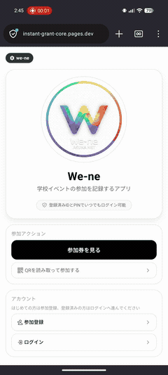

# instant-grant-core

[](https://github.com/hk089660/instant-grant-core/actions/workflows/ci.yml)
[](#local-validation-snapshot)
[](#validation-and-deployment-checks)

Prototype platform for addressing the social problem of black-box grant administration by making school participation operations and grant operations auditable on Solana.
This repository combines an Anchor program, a Cloudflare Worker API, and an Expo / Cloudflare Pages frontend for the We-ne / Asuka Network Core prototype.



_We-ne mobile flow from first-time registration to event participation and token receipt_

[日本語 README](./README.md)

## At a Glance

This README reflects the public-environment snapshot from 2026-03-10 plus implementation updates through 2026-03-12.

### Current Status

| Area | Status | Latest signal |
| --- | --- | --- |
| CI | active | GitHub Actions `CI` runs on `push`, `pull_request`, and `workflow_dispatch`, covering lockfile policy, Rust, Anchor, Worker, and mobile checks |
| `grant_program` | passing | `cargo check --all-features`, `cargo clippy --all-targets -- -D warnings`, `anchor build`, and `anchor test --skip-build --provider.cluster localnet` were rerun on 2026-03-12 |
| `api-worker` | passing | `npm test` passed with 86 tests, and `npx tsc --noEmit` passed |
| `wene-mobile` | passing | `npm run test:server` passed with 22 tests, and `npx tsc --noEmit` passed |
| public readiness | passing | `npm run verify:production` reported 11/11 checks passed on 2026-03-10 |
| code maturity | Phase 1 PoC | automated checks exist, but the trust model is still prototype-centralized and the next phase explicitly targets single-key and static-entry weaknesses |

### Design Direction

This repository is not presented as a finished trustless system. It is **Phase 1: a functional PoC** focused on validating UX, L1 / L2 linkage, PoP, hash-chain-backed auditability, and real operator flows.

The intended next phase is a **dynamic security substrate that can detect attacks, zeroize vulnerable surfaces, isolate damage, and recover without destroying evidence**. The two main explicit weaknesses being carried forward are:

- a still-centralized signer / operator boundary around `api-worker`
- reliance on static venue-entry surfaces such as QR-based offline entry points

The planned direction is:

- network / control plane: TEE or secure enclave signing, ephemeral key ratchets, role-key separation, threshold signer / multisig
- physical / venue plane: TOTP-backed dynamic QR, short-lived tokens, stronger anti-replay venue flows
- recovery plane: detection, isolation, zeroization, and evidence-preserving cutover / recovery

For the full design rationale, see [docs/DESIGN_PRINCIPLES.md](./docs/DESIGN_PRINCIPLES.md).

### Public Surfaces

| Surface | URL |
| --- | --- |
| User app | `https://instant-grant-core.pages.dev/` |
| Admin app | `https://instant-grant-core.pages.dev/admin/login` |
| Worker API | `https://instant-grant-core.haruki-kira3.workers.dev` |

Admin demo passcode: `83284ab4d9874e54b301dcf7ea6a6056`

### Public Readiness Endpoints

| Endpoint | URL | Observed state on 2026-03-10 |
| --- | --- | --- |
| PoP status | `https://instant-grant-core.pages.dev/v1/school/pop-status` | `enforceOnchainPop=true`, `signerConfigured=true` |
| Runtime status | `https://instant-grant-core.pages.dev/v1/school/runtime-status` | `ready=true` |
| Audit status | `https://instant-grant-core.pages.dev/v1/school/audit-status` | `operationalReady=true` |

### Implementation Update on 2026-03-12

- `api-worker` `POST /v1/school/pop-proof` now reuses a fresh proof for the same claim request, preventing unnecessary PoP chain advancement when users or admins retry from another device
- PoP proof issuance is still serialized with `popProofLock`, so both concurrent access and rapid repeated retries are handled on the Worker side
- Combined with duplicate `solanaAuthority + solanaMint + solanaGrantId` rejection, this reduces grant-scoped PoP stream contention in multi-terminal operations
- Added `update_grant` instruction to `grant_program` and changed `create_grant` from `init_if_needed` to `init`, eliminating the hidden update capability. Grant parameter changes now require an explicit `update_grant` call
- Documented PoP's guarantee as **signer-authenticated process receipt binding** in both code comments and README
- Clarified the dual-backend structure: `wene-mobile/server` is a test-only stub; `api-worker` is the sole production backend
- The `api-worker` regression check for this change was rerun with `npm test`, and passed with `86 tests passed`

### Local Validation Snapshot

| Area | Command | Verified on | Result |
| --- | --- | --- | --- |
| `grant_program` | `cargo check --all-features` | 2026-03-12 | passed |
| `grant_program` | `cargo clippy --all-targets -- -D warnings` | 2026-03-12 | passed |
| `grant_program` | `anchor build` | 2026-03-12 | passed |
| `grant_program` | `anchor test --skip-build --provider.cluster localnet` | 2026-03-12 | 4 tests passed |
| `api-worker` | `npm test` | 2026-03-12 | 86 tests passed |
| `wene-mobile` | `npm run test:server` | 2026-03-12 | 22 tests passed |
| `api-worker` | `npx tsc --noEmit` | 2026-03-12 | passed |
| `wene-mobile` | `npx tsc --noEmit` | 2026-03-12 | passed |
| root | `npm run check:lockfiles` | 2026-03-10 | passed |
| root | `npm run verify:production` | 2026-03-10 | 11/11 checks passed |

## Architecture

### Repository Layers

| Directory | Role | Notes |
| --- | --- | --- |
| `grant_program/` | Solana program built with Anchor | Handles on-chain grant claim execution. On-chain claims require PoP-linked claim evidence inside claim instructions. |
| `api-worker/` | Production backend (Cloudflare Worker + Durable Object) | Issues off-chain participation receipts, exposes admin/master audit APIs, and publishes readiness endpoints. The sole runtime for production and Devnet. |
| `wene-mobile/` | Expo application for user, admin, and local master flows | Deployed as Cloudflare Pages for the web surfaces. |
| `wene-mobile/server/` | Test and local-dev stub only (Node.js / Express) | **Not a production backend.** Used only by `npm run test:server` (Vitest) and local development. Storage is in-memory (volatile). PoP and audit chain are not implemented. |

> **Why two backends?** `api-worker` is the sole production backend. `wene-mobile/server` is a Node.js equivalent stub of the same API surface used exclusively for unit tests. Nothing in `wene-mobile/server` is ever deployed.

### Implemented Flows

- Attend: off-chain participation issuance with `confirmationCode` and immutable `ticketReceipt`
- Optional walletless claim path when event policy allows it
- Policy-gated on-chain redeem path with PoP proof and Solana transaction evidence
- Worker-side contention control for multi-terminal PoP proof retries on the same claim via short-lived idempotent proof reuse
- Admin participant search, transfer audit, and runtime readiness UI
- Master-only disclosure and indexed search APIs
- API guardrails for rate limiting, payload limits, and Cost of Forgery integration hooks

## Trust and Verification Model

### What PoP (Proof of Process) guarantees

**PoP guarantees that a specific signer has authenticated a process receipt that is binding to the claim being executed — that is, a *signer-authenticated process receipt binding*.**

- PoP does **not** guarantee continuity of an on-chain canonical chain. The chain head (`last_global_hash` / `last_stream_hash`) advances on a best-effort basis and does not reject concurrent claims.
- The sole on-chain double-claim guard is the receipt PDA `init` constraint: a second initialization for the same period fails at the Anchor level.
- Including a non-zero `audit_hash` in the v2 message format is mandatory; a zero field is rejected.

### Trust boundary and verification

- Off-chain Attend can be verified through public receipt APIs such as `POST /api/audit/receipts/verify-code`, but this still relies on the Worker and stored audit data.
- On-chain Redeem can be verified independently from Solana transaction and account state.
- Worker-side PoP proof issuance is serialized per grant, and fresh repeated access for the same claim returns the same proof to suppress duplicate multi-device issuance.
- The current trust model is still prototype-centralized: the system uses a single PoP signer / operator boundary today. Planned decentralization work is tracked in [docs/ROADMAP.md](./docs/ROADMAP.md).

## Quick Start

### Prerequisites

Validated locally on 2026-03-10 with:

| Tool | Version |
| --- | --- |
| Node.js | `v20.19.4` |
| npm | `10.8.2` |
| `anchor-cli` | `0.31.1` |
| `solana-cli` | `3.0.13` |
| `rustc` | `1.92.0` |

Node.js and npm are enough for app-only work.
Rust, Solana CLI, and Anchor are also required for contract work.

### Install Dependencies

```bash
npm ci

cd api-worker
npm ci

cd ../wene-mobile
npm ci --legacy-peer-deps

cd ../grant_program
npm ci
```

### Run Locally

1. Start the Worker API.

```bash
cd api-worker
npx wrangler dev
```

The API starts at `http://localhost:8787`.

2. Configure the frontend.

```bash
cd wene-mobile
cp .env.example .env.local
```

Set at least:

```bash
EXPO_PUBLIC_API_BASE_URL=http://localhost:8787
EXPO_PUBLIC_API_MODE=http
```

For on-chain flows, also configure the Solana values in [wene-mobile/.env.example](./wene-mobile/.env.example), especially:

- `EXPO_PUBLIC_SOLANA_RPC_URL`
- `EXPO_PUBLIC_SOLANA_CLUSTER`
- `PROGRAM_ID`

3. Start the web surface.

```bash
cd wene-mobile
npm run web
```

Open the local Expo web URL shown in the terminal, then navigate to:

- `/` for the user surface
- `/admin/login` for the admin surface
- `/master/login` for the local master surface

## Validation and Deployment Checks

### Local Validation Commands

Use these commands when refreshing the verification snapshot in this README:

```bash
npm run check:lockfiles

cd api-worker
npm test
npx tsc --noEmit

cd ../wene-mobile
npm run test:server
npx tsc --noEmit

cd ../grant_program
anchor build
anchor test --skip-build --provider.cluster localnet
```

Notes:

- Root `npm run build` runs `anchor build` and the mobile TypeScript check.
- Root `npm run test` only runs the Anchor test suite.
- `wene-mobile` intentionally uses `npm ci --legacy-peer-deps`.

### Verify the Deployed Environment

Quick public checks:

```bash
BASE="https://instant-grant-core.pages.dev"

curl -s "$BASE/v1/school/pop-status"
curl -s "$BASE/v1/school/runtime-status"
curl -s "$BASE/v1/school/audit-status"
```

Full production readiness check:

```bash
npm run verify:production
```

Optional environment variables:

- `WORKER_BASE_URL`
- `PAGES_BASE_URL`
- `SOLANA_RPC_URL`
- `MASTER_TOKEN` for master-protected checks

The current readiness script validates:

- Worker root health
- PoP status
- audit status
- runtime readiness
- Pages proxy readiness
- On-chain `pop-config` alignment for published events
- Expected `401` behavior on protected master endpoints without a token

## Repository Guide

| Path | Purpose |
| --- | --- |
| `grant_program/` | Solana contract workspace; commands are defined in [grant_program/package.json](./grant_program/package.json) |
| [api-worker/README.md](./api-worker/README.md) | API contract, Worker variables, audit and PoP operations |
| [wene-mobile/README.md](./wene-mobile/README.md) | App-specific flow, mobile/web usage, and Expo details |
| [docs/ARCHITECTURE.md](./docs/ARCHITECTURE.md) | Architecture overview |
| [docs/DEVELOPMENT.md](./docs/DEVELOPMENT.md) | Contributor setup |
| [docs/DEVNET_SETUP.md](./docs/DEVNET_SETUP.md) | Devnet claim verification |
| [docs/SECURITY.md](./docs/SECURITY.md) | Security model and operational controls |
| [docs/POP_CHAIN_OPERATIONS.md](./docs/POP_CHAIN_OPERATIONS.md) | PoP chain recovery, grant reuse guardrails, and multi-terminal contention handling |
| [docs/ROADMAP.md](./docs/ROADMAP.md) | Planned decentralization and pilot milestones |

## Development Notes

- Canonical package manager: `npm`
- Canonical lockfiles: root / `api-worker` / `wene-mobile` / `grant_program` `package-lock.json`
- CI enforces the lockfile policy and rejects `yarn.lock`, `pnpm-lock.yaml`, and non-canonical lockfile names
- Root production verification script: [scripts/verify-production-readiness.mjs](./scripts/verify-production-readiness.mjs)

## License

[MIT](./LICENSE)
