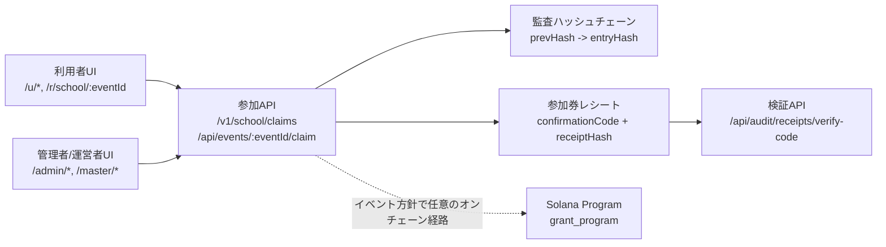
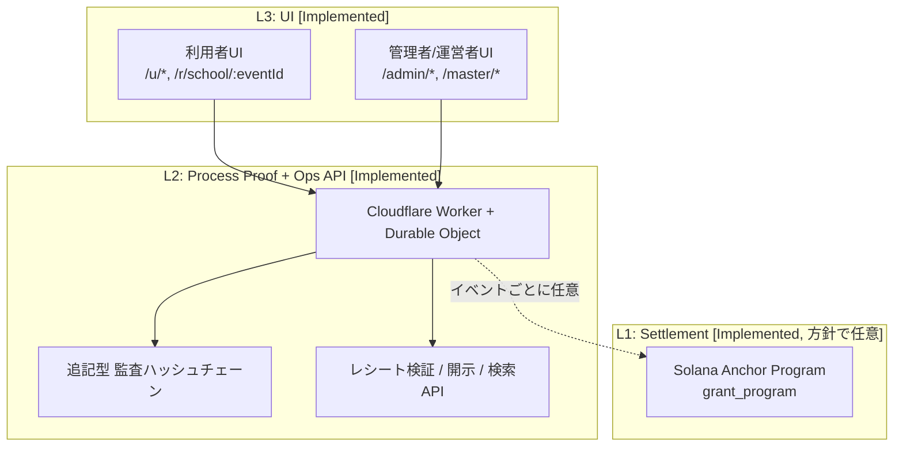

# Asuka Network Core（Prototype）

PoP（Proof of Process）で、学校/公共の参加運用と給付運用を監査可能にする公開プロトタイプです。

[English README](./README.md)

**稼働URL（We-ne）**
- 利用者: `https://instant-grant-core.pages.dev/`
- 管理者: `https://instant-grant-core.pages.dev/admin/login`（デモログインコード: `83284ab4d9874e54b301dcf7ea6a6056`）

**Status as of 2026-02-22**

## クイックナビ
- [Top Summary](#top-summary)
- [可視化サマリー](#可視化サマリー)
- [Verification Evidence (UI)](#verification-evidence-ui)
- [現在実装されていること](#現在実装されていること)
- [アーキテクチャ](#アーキテクチャ)
- [Reviewer Quickstart（10分）](#reviewer-quickstart10分)
- [Verification Evidence](#verification-evidence)
- [Milestones / 助成金で実施する範囲](#milestones--助成金で実施する範囲)

## Top Summary
- これは何か: 運用プロセスのログを検証可能レシートに結合し、必要時のみSolana決済へ結合する3層システムです。
- 誰のためか: イベント参加者（学生/利用者）と、運用する管理者・運営者のための実装です。
- [Implemented] 学生/利用者の参加は、対応経路では wallet なしで完了できます（off-chain 参加券として `confirmationCode` + `ticketReceipt` を発行）。
- [Optional] オンチェーン決済証跡は devnet の任意経路です。tx/receipt/Explorer は on-chain claim 経路を実行した場合のみ表示されます。
- [Implemented] 説明責任ある運用: admin/master 導線で PoP/runtime 状態、送金監査ログ、権限別開示/検索を確認できます。
- [Implemented] 管理者の参加券検索は所有者スコープです。admin は自分が発行したイベント分のみ検索対象で、master は全体対象です。
- [Implemented] PoPのUI確認: 管理者イベント一覧に `PoP稼働証明` を表示し、`enforceOnchainPop` / `signerConfigured` を `/v1/school/pop-status` と紐付けて確認できます。
- [Implemented] Hash Chain稼働UI: イベント詳細で `送金監査 (Hash Chain)` を表示し、on/off-chain の各記録で `prevHash -> entryHash` を確認できます。
- [Implemented] 利用者向け証跡UI: 成功画面で `confirmationCode`、監査レシート（`receipt_id`, `receipt_hash`）、PoP証跡コピー導線（条件付き）を表示します。
- [Implemented] 管理者のイベント発行は、管理者認証に加えて Phantom 接続と runtime readiness を必須にしています。
- [Implemented] 検証用 endpoint: `/v1/school/pop-status`、`/v1/school/runtime-status`、`/v1/school/audit-status`、`/api/audit/receipts/verify-code`。
- 現在の公開先（We-ne）: 利用者 `https://instant-grant-core.pages.dev/` / 管理者 `https://instant-grant-core.pages.dev/admin/login`。
- 成熟度: 本番完成形ではなく、再現性と第三者検証性を重視したプロトタイプです。
- リポジトリ内の事実ソース: `api-worker/src/storeDO.ts`、`wene-mobile/src/screens/user/*`、`wene-mobile/src/screens/admin/*`、`grant_program/programs/grant_program/src/lib.rs`。

## 可視化サマリー


## Project Direction
- [Implemented] 近接のSolana貢献: 監査可能な運用（accountable P2P public operations）を、再現可能な参照実装として提示します。
- [Implemented] 現在の実装範囲は実務寄りで、学生/利用者の参加導線と admin/master の運用証跡を第三者が検証できます。
- [Planned] 現行設計を、複数機関が共同運用できる administration-operable federation model に一般化します。
- [Planned] 将来の公共基盤に向けて settlement interface を chain-agnostic adapter へ一般化します（PoC段階の実装基盤は引き続きSolana）。
- [Planned] この助成/PoC段階で独立チェーンを新規立ち上げる計画は含みません。

## Stage Clarity
> - [Implemented] Off-chain Attend は、方針が許すイベントで wallet なしでも参加券（`confirmationCode` + `ticketReceipt`）を発行します。
> - [Optional] On-chain redeem / PoP は on-chain 導線でのみ実行され、tx signature / receipt pubkey / Explorer 証跡は条件付きで表示されます。
> - [Implemented] PoP/runtime/audit の運用確認は公開 endpoint と管理者UIで確認できます。
> - [Planned] 高度なSybil耐性、連合運用向け設計、chain-agnostic adapter 設計はロードマップ項目です。

## なぜ重要か（課題）
給付や学校参加の運用は最終結果だけが公開されやすく、処理過程の透明性が不足しがちなため、誰が何を実行したか・監査チェーンが整合しているか・決済証跡とどう結び付くかを第三者が検証できる形で示すことが重要です。

## Verification Evidence (UI)
- [Implemented] PoP稼働証明:
  - 管理者UI導線: `/admin`（イベント一覧）で `PoP Runtime Proof` / `PoP稼働証明` パネルを確認。
  - UI表示項目: `enforceOnchainPop`、`signerConfigured`、`signerPubkey`、`verification endpoint: /v1/school/pop-status`。
  - バックエンド根拠: `GET /v1/school/pop-status`（`api-worker/src/storeDO.ts`）。
  - 本READMEでの PoP「ready」判定は `enforceOnchainPop=true` かつ `signerConfigured=true`。
- [Implemented] Transfer Audit (Hash Chain):
  - 管理者UI導線: `/admin/events/:eventId` の `送金監査 (Hash Chain)` セクション。
  - 連鎖証跡: `hash: <prev> -> <current>` / `chain: <prev> -> <current>` を on/off-chain それぞれで確認可能。
  - CSV出力: 同じイベント詳細画面の `CSVダウンロード` ボタン。
- [Implemented] 管理者参加券検索のスコープ:
  - 管理者UI導線: `/admin/participants`。
  - 振る舞い: admin は所有イベントの参加券のみ検索対象、master は全体対象。
  - バックエンド根拠: `/v1/school/events?scope=mine` と `/v1/school/events/:eventId/claimants`（`api-worker/src/storeDO.ts` の owner check）。
- [Restricted] Master Dashboard の監査/開示:
  - 高権限機能（招待コード、監査ログ、管理者開示、検索）は `wene-mobile/app/master/index.tsx`。
  - 公開URLは意図的に本READMEへ掲載しません。
  - ローカル限定アクセス: ローカルWeb起動後に localhost の master ルート（`/master/login`）へアクセス、またはローカル実行出力/route list を参照。
  - PII制御: 初期表示は `pii: hidden`、明示トグル（`Show PII`）でのみ表示。admin向け transfer API は no-PII（`api-worker/src/storeDO.ts` の `strictLevel: admin_transfer_visible_no_pii`）。

## 現在実装されていること

### Truth Table（Implemented / Planned）
| 機能 | 状態 | 根拠 |
|---|---|---|
| `Participation Ticket (off-chain Attend)` の不変レシート発行 | `Implemented` | `api-worker/src/storeDO.ts`（`/v1/school/claims`、`/api/events/:eventId/claim`、レシート生成/検証） |
| `On-chain Redeem (optional)` のPhantom署名フロー | `Implemented` | `wene-mobile/src/screens/user/UserConfirmScreen.tsx`、`grant_program/programs/grant_program/src/lib.rs` |
| PoP稼働状態の公開エンドポイント | `Implemented` | `/v1/school/pop-status`、`/v1/school/runtime-status`、`/v1/school/audit-status` |
| 管理者参加券検索の所有者スコープ | `Implemented` | `/admin/participants`、`wene-mobile/src/screens/admin/AdminParticipantsScreen.tsx`、`/v1/school/events?scope=mine`、`/v1/school/events/:eventId/claimants` の owner check（`api-worker/src/storeDO.ts`） |
| 管理者画面での送金監査（onchain/offchain分離） | `Implemented` | `wene-mobile/src/screens/admin/AdminEventDetailScreen.tsx`、`/api/admin/transfers` |
| 運営者優先の厳格開示（`master > admin`） | `Implemented` | `/api/master/transfers`、`/api/master/admin-disclosures`、`wene-mobile/app/master/index.tsx` |
| サーバー側インデックス検索（DO SQLite永続化） | `Implemented` | `/api/master/search`、`api-worker/src/storeDO.ts`（`master_search_*`テーブル） |
| FairScale等の高度なSybil耐性 | `Planned` | `docs/ROADMAP.md` |
| 連合運用モデル（複数機関の共同運用） | `Planned` | 設計/ロードマップ段階（このリポジトリには未実装） |
| chain-agnostic な決済 adapter（将来の公共基盤） | `Planned` | 方向性のみ（この助成/PoC段階で独立チェーン立ち上げは行わない） |

### 1) 学生/利用者体験
- `Implemented`: 参加導線は `/u/scan` → `/u/confirm` → `/u/success` で接続済み。
  - コード: `wene-mobile/src/screens/user/UserScanScreen.tsx`、`wene-mobile/src/screens/user/UserConfirmScreen.tsx`、`wene-mobile/src/screens/user/UserSuccessScreen.tsx`
- `Implemented`: `displayName + PIN` / `userId + PIN` で登録・認証。
  - API: `/api/users/register`、`/api/auth/verify`
- `Implemented`: Attend時に生成される証跡:
  - `confirmationCode`
  - `ticketReceipt`（`receiptId`、`receiptHash`、`entryHash`、`prevHash`、`streamPrevHash`、immutable sink参照）
  - コード: `api-worker/src/storeDO.ts`（`buildParticipationTicketReceipt`）
- `Implemented`: wallet不要導線は条件付きで実装済み:
  - `/r/school/:eventId`（Web）は `joinToken` で wallet不要 Attend が可能
  - `/u/*` は、イベント方針がオンチェーン必須でない場合に wallet不要で完了可能
  - コード: `wene-mobile/src/hooks/useSchoolClaim.ts`、`api-worker/src/storeDO.ts`
- `Implemented`: `On-chain Redeem (optional)` を使った場合、`txSignature`、`receiptPubkey`、`mint`、PoPハッシュが返ります。

### 2) 運用者/管理者体験
- `Implemented`: 管理者ログインとロール付き認証。
  - UI: `/admin/login`
  - API: `/api/admin/login`
- `Implemented`: イベント発行は runtime readiness とウォレット署名を要求。
  - UI: `AdminCreateEventScreen` の runtimeカード
  - API: `/v1/school/runtime-status`
- `Implemented`: 管理者ダッシュボードで PoP 稼働証明を表示。
  - UI: `wene-mobile/src/screens/admin/AdminEventsScreen.tsx`
- `Implemented`: 管理者参加券検索は所有イベント発行分のみを対象化。
  - UI: `/admin/participants`（`wene-mobile/src/screens/admin/AdminParticipantsScreen.tsx`）
  - API: `/v1/school/events?scope=mine` + `/v1/school/events/:eventId/claimants`（`api-worker/src/storeDO.ts` の所有者スコープ判定）
- `Implemented`: イベント詳細画面で以下を表示:
  - 参加者一覧 + 確認コード
  - 送金監査ログの `On-chain署名` / `Off-chain監査署名` 分離
  - Hash Chain の連鎖表示（`送金監査 (Hash Chain)`、`hash: <prev> -> <entry>`、`chain: <prev> -> <entry>`）
  - コード: `wene-mobile/src/screens/admin/AdminEventDetailScreen.tsx`
- `Implemented`: Master画面で招待コード発行/失効/改名、全開示、検索が可能。
  - UI: `wene-mobile/app/master/index.tsx`
  - API: `/api/admin/invite`、`/api/admin/revoke`、`/api/admin/rename`、`/api/master/admin-disclosures`、`/api/master/search`

### 3) セキュリティ/濫用耐性（Current + Planned）
- `Implemented`: subject単位の回数制御（期間/上限）と `alreadyJoined` 振る舞い。
  - コード: `api-worker/src/claimLogic.ts`
- `Implemented`: `ENFORCE_ONCHAIN_POP=true` かつイベントがオンチェーン設定済みの場合、証跡フィールドを必須化。
  - API: `/v1/school/claims`、`/api/events/:eventId/claim`
- `Implemented`: `AUDIT_IMMUTABLE_MODE=required` で immutable sink が不調なら更新系APIを fail-close。
  - コード: `api-worker/src/storeDO.ts`
- `Implemented`: 厳格レベル分離:
  - admin: 識別子は見えるがPIIは非開示（`strictLevel: admin_transfer_visible_no_pii`）
  - master: 全開示（`strictLevel: master_full`）
- `Planned`: FairScale等のより強いSybil耐性/資格判定連携。

## アーキテクチャ



```text
L3: UI（Implemented）
  - 利用者: /u/*, /r/school/:eventId（RN/Web）
  - 管理者/運営者: /admin/*, /master/*
          |
          v
L2: Process Proof + Ops API（Implemented）
  - Cloudflare Worker + Durable Object
  - 追記型監査ハッシュチェーン + immutable sink
  - 参加券検証API、admin/master開示・検索
          |
          v
L1: Settlement（Implemented、イベント方針で任意/必須切替）
  - Solana Anchor program（`grant_program`）
  - PoP検証付きclaim命令 + claim receipt

開発専用の任意経路:
  - `wene-mobile/server/*` はローカル検証用のモックAPI。
```

## Reviewer Quickstart（10分）

### A) Live URL（推奨）
- 利用者アプリ: `https://instant-grant-core.pages.dev/`
- 管理者ログイン: `https://instant-grant-core.pages.dev/admin/login`
- [Restricted] Master Dashboard の公開URLは意図的に本READMEへ掲載しません。
- ローカル限定レビュー手順: `cd wene-mobile && npm run web` 実行後、localhost の `/master/login` を使用。

### B) 2分の稼働チェック
```bash
BASE="https://instant-grant-core.pages.dev"
curl -s "$BASE/health"
curl -s "$BASE/v1/school/pop-status"
curl -s "$BASE/v1/school/runtime-status"
curl -s "$BASE/v1/school/audit-status"
```
期待値:
- `/health` は `{"ok":true}`
- `pop-status.signerConfigured=true`
- `runtime-status.ready=true`
- `audit-status.operationalReady=true`

### C) 画面操作（admin login → event → print QR → scan → confirm → success）
1. `/admin/login` でログイン（発行済み管理者コード、または運用側から提供されたデモ/管理者パスワード）。
2. `Published` イベントを開き、`印刷用PDF` で受付QRを表示。
3. 利用者側（`/u`）で登録/ログイン（`/u/register` または `/u/login`）後、`/u/scan` でQR読み取り。
4. `/u/confirm` でPIN確認（オンチェーン必須方針イベントのみPhantom必須）。
5. `/u/success` に遷移。

終了時の期待出力:
- Off-chain Attend 証跡:
  - `confirmationCode`
  - `監査レシート（参加券）`カードの `receipt_id` と `receipt_hash`
- On-chain Redeem 証跡（その導線を使った場合）:
  - `txSignature` + `receiptPubkey` + `mint`
  - Explorerボタン（tx/address）
  - PoP値（`signer`、`entry_hash`、`audit_hash`）

### D) 参加券のコード検証
成功画面の `eventId` と `confirmationCode` を使用:
```bash
curl -s -X POST "$BASE/api/audit/receipts/verify-code" \
  -H "content-type: application/json" \
  -d '{"eventId":"<EVENT_ID>","confirmationCode":"<CONFIRMATION_CODE>"}'
```
期待値: `ok=true` と `verification.checks`（連鎖/ハッシュ検証結果）が返る。

### E) よくある失敗と見分け方
- `runtime-status.ready=false`:
  - `blockingIssues` を見て `ADMIN_PASSWORD` / PoP signer / immutable sink 設定不足を特定。
- `PoP署名者公開鍵...` エラー:
  - Workerの `POP_SIGNER_*` と `EXPO_PUBLIC_POP_SIGNER_PUBKEY` を確認。
- `on-chain claim proof required` / `wallet_required`:
  - オンチェーン設定済み + 強制方針で、ウォレット/証跡が不足。
- `/api/admin/*` や `/api/master/*` が `401`:
  - bearer token が未設定または不正。

### F) ローカル最小再現
```bash
cd api-worker && npm ci && npm test && npx tsc --noEmit
cd ../wene-mobile && npm ci && npm run test:server && npx tsc --noEmit
```

## Verification Evidence

### 1) Off-chain証跡 `[Implemented]`
`/u/success` の参加完了時に確認:
- `confirmationCode`
- `監査レシート（参加券）`（`receipt_id`, `receipt_hash`）
- コピー内容に `verify_api: /api/audit/receipts/verify-code` を含む

コード検証:
```bash
curl -s -X POST "https://instant-grant-core.pages.dev/api/audit/receipts/verify-code" \
  -H "content-type: application/json" \
  -d '{"eventId":"<EVENT_ID>","confirmationCode":"<CONFIRMATION_CODE>"}'
```
期待値: `ok=true` と `verification.checks`（連鎖/ハッシュ検証）が返る。

### 2) On-chain証跡 `[Optional]`
`wene-mobile/src/screens/user/UserConfirmScreen.tsx` の on-chain 導線を実行した場合のみ:
- 成功画面に `txSignature`、`receiptPubkey`、（任意で）`mint`、PoP値が表示
- 値があるときだけ Explorer リンクが表示

Explorer形式:
- Tx: `https://explorer.solana.com/tx/<signature>?cluster=devnet`
- Receipt/Mint: `https://explorer.solana.com/address/<pubkey>?cluster=devnet`

### 3) PoP/runtime運用状態 `[Implemented]`
管理者UIルート:
- `/admin` のイベント一覧に `PoP稼働証明` カードを表示（`wene-mobile/src/screens/admin/AdminEventsScreen.tsx`）
- カード内に `verification endpoint: /v1/school/pop-status` を表示

Runtime/API検証:
```bash
curl -s https://instant-grant-core.pages.dev/v1/school/pop-status
curl -s https://instant-grant-core.pages.dev/v1/school/runtime-status
curl -s https://instant-grant-core.pages.dev/v1/school/audit-status
```
判定基準:
- `pop-status.enforceOnchainPop=true` かつ `pop-status.signerConfigured=true` で on-chain PoP 強制設定が有効。
- `runtime-status.ready=true` で運用前提が成立
- `audit-status.operationalReady=true` で immutable sink が稼働
- `audit-integrity.ok=true` で最近の監査連鎖整合性が成立:
```bash
curl -s -H "Authorization: Bearer <MASTER_PASSWORD>" \
  "https://instant-grant-core.pages.dev/api/master/audit-integrity?limit=50"
```

### 4) UI上の証跡位置
- PoP稼働証明カード:
  - `wene-mobile/src/screens/admin/AdminEventsScreen.tsx`
  - `PoP稼働証明`、`/v1/school/pop-status` 表示
- Hash Chain稼働 + on/off-chain 送金監査分離:
  - `wene-mobile/src/screens/admin/AdminEventDetailScreen.tsx`
  - `送金監査 (Hash Chain)`、`On-chain署名` / `Off-chain監査署名`、`hash: ... -> ...` / `chain: ... -> ...`
- 参加券証跡カードとコピー導線:
  - `wene-mobile/src/screens/user/UserSuccessScreen.tsx`

## Milestones / 助成金で実施する範囲

| マイルストーン | Deliverable | Success Criteria | Reviewer向け証跡 |
|---|---|---|---|
| M1: 再現性 + 証跡整備（10分レビュー） | [Implemented] Live/Localを短時間で検証できる手順と証跡導線を固定化 | 初見レビュアーが隠し設定なしで約10分で稼働確認と証跡確認を実行できる | 本README + `/v1/school/pop-status` + `/v1/school/runtime-status` + `/api/audit/receipts/verify-code` |
| M2: 説明責任の強化 | [Implemented] 運用証跡UI（`PoP稼働証明`、`送金監査 (Hash Chain)`、on/off-chain送金監査分離、権限別開示）+ [Implemented] 整合性確認API（`/api/master/audit-integrity`） | 運用者が証跡を確認でき、監査者が master 認証で整合性チェックを実行できる | `wene-mobile/src/screens/admin/AdminEventsScreen.tsx`、`wene-mobile/src/screens/admin/AdminEventDetailScreen.tsx`、`wene-mobile/app/master/index.tsx`、`api-worker/src/storeDO.ts` |
| M3: 連合運用に向けた一般化 | [Planned] federation model 文書化 + chain-agnostic adapter 境界の最小PoCフック（新規チェーン立ち上げは対象外） | 現行Solana参照実装を維持したまま、連合運用/adapter境界が明示される | `docs/ROADMAP.md` + 今後のPR（adapter/federation interface） |

## Scope Clarity

> **このリポジトリ/本助成の評価対象（In scope）**
> - 学校参加導線の再現可能性
> - `Participation Ticket (off-chain Attend)` と不変監査レシート
> - 方針切替付き `On-chain Redeem (optional)`
> - admin/master の監査性、開示分離、検証API
>
> **評価対象外（Out of scope, planned）**
> - 全イベントでの完全walletlessオンチェーン決済
> - 自治体/機関間の本番連合運用展開（この段階では設計一般化のみ）
> - この助成/PoC段階での独立チェーン新規立ち上げ

## Links and Docs
- アーキテクチャ: `docs/ARCHITECTURE.md`
- セキュリティ: `docs/SECURITY.md`
- ロードマップ: `docs/ROADMAP.md`
- Devnetセットアップ: `docs/DEVNET_SETUP.md`
- Worker API詳細: `api-worker/README.md`
- UI検証レポート: `wene-mobile/docs/STATIC_VERIFICATION_REPORT.md`

### Reviewer Shortcut（事実確認用ファイル）
- `api-worker/src/storeDO.ts`
- `api-worker/src/claimLogic.ts`
- `grant_program/programs/grant_program/src/lib.rs`
- `wene-mobile/src/screens/user/UserConfirmScreen.tsx`
- `wene-mobile/src/screens/user/UserSuccessScreen.tsx`
- `wene-mobile/src/screens/admin/AdminEventsScreen.tsx`
- `wene-mobile/src/screens/admin/AdminEventDetailScreen.tsx`
- `wene-mobile/app/master/index.tsx`

## License
MIT
