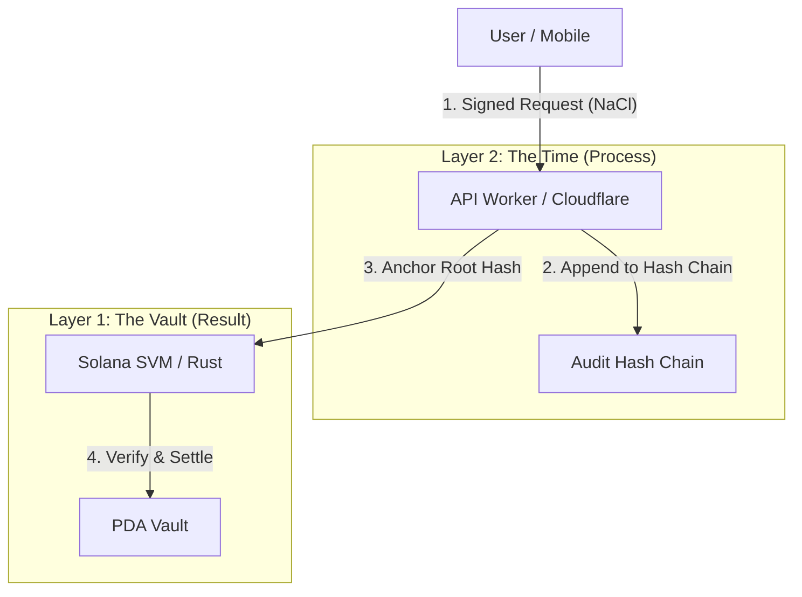

# Asuka Network Core (Prototype)
> **Proof of Process (PoP) に基づく、日本発の監査可能な公共ブロックチェーン・プロトコル**

[]
[]
[]
[]

## ⚡ デモを体験する (We-ne)
Asuka Network上で稼働する最初の行政・公共向けリファレンス実装「We-ne」は、今すぐブラウザから体験可能です。
インストール不要。エッジで動作する爆速の承認プロセスを確認してください。

[🚀 **Launch We-ne (Web App)**](https://instant-grant-core.pages.dev/)

[🚀 **Launch We-ne (Web admin App)**](https://instant-grant-core.pages.dev/admin/login)

---

## 📖 プロジェクト概要
**Asuka Network** は、行政手続きや助成金給付における「プロセスの不透明性（Process Opacity）」を解決するために設計された、次世代の公共インフラ・プロトコルです。

既存のパブリックチェーンは「結果（残高の移動）」の整合性は保証しますが、「過程（どのような手続きを経てそのトランザクションが生成されたか）」はブラックボックスでした。
本プロジェクトでは、Web2的なAPIログを不可逆なハッシュチェーンとして刻み、それをオンチェーンの決済と数学的に結合させる **「Proof of Process (PoP)」** という新たなコンセンサス概念を提唱・実装します。

## 📌 AsukaNetwork の現状（2026-02-21）

- 稼働モードは **devnet-first** です（現行アプリ実行時のクラスターは devnet 固定）。
- Cloudflare Workers 上のプロセス証明レイヤーは稼働中です:
  - API監査ログをグローバルチェーン（`prev_hash`）で連結
  - かつイベント単位の連鎖（`stream_prev_hash`）も保持
  - 監査エントリは Durable Object 外の不変シンク（R2 content-addressed + 任意の immutable ingest webhook）へも固定化し、更新系APIでは fail-close（`AUDIT_IMMUTABLE_MODE=required`）を適用
- オペレーター向け認可強化は適用済みです:
  - 管理者向け学校APIは Bearer 認証必須
  - Master専用APIは既定値ではなく実値の `ADMIN_PASSWORD` を必須化
- 公開デモは稼働中です:
  - 利用者アプリ: `https://instant-grant-core.pages.dev/`
  - 管理者アプリ: `https://instant-grant-core.pages.dev/admin/login`
- Layer 1 の PoP 決済結合は稼働中です:
  - `claim_grant` / `claim_grant_with_proof` で、PoP 証明をオンチェーンで必須検証します。
  - Ed25519 事前命令、許可済み PoP 署名者（`pop_config`）、ハッシュチェーン継続性（`pop_state`）を L1 で検証します。
  - PoP v2 は API 監査アンカー（audit hash）を署名メッセージに含み、entry hash を L1 側で再計算・照合します。

## 🏗 アーキテクチャ：三位一体の信頼基盤
本リポジトリは、以下の3層構造（Trinity Architecture）によって「責任の所在」をコードで定義します。

レイヤー別の実装状況:

- Layer 1（Solana決済/claim）: claim 命令で PoP 強制検証を実装済み（ed25519 + 正規署名者 + 連鎖継続 + 有効期限チェック）。
- Layer 2（APIプロセス証明）: 実装済み（グローバルハッシュチェーン + イベント単位連鎖 + 監査アンカー束縛付き PoP 証明発行 + 管理者認可）。
- Layer 3（利用者/管理者UI）: 実装済み（Web/Mobile UX、Phantom署名/deeplink、管理者セッションガード）。
- Pages配信用エッジプロキシ: `functions/[[path]].ts` と `wene-mobile/functions/[[path]].ts` で実装済み（`/api/*`、`/v1/*`、`/metadata/*`、`/health`）。

### 1. Layer 1: The Vault (結果の保証)
* **技術スタック:** Rust, Anchor Framework (Solana SVM)
* **役割:** 価値の保存と決済のファイナリティ。
* **革新点:** **PDA (Program Derived Address)** の決定論的なシード生成を用い、データベースに依存することなく、物理法則レベルで「二重給付（Double-Spending）」を防止します。
* [📂 View Contract Code](./grant_program)

### 2. Layer 2: The Time (過程の証明)
* **技術スタック:** TypeScript, Cloudflare Workers (Edge Computing)
* **役割:** 時間とプロセスの監査人。
* **革新点:** 全てのリクエストに対し、グローバル直前ハッシュ（`prev_hash`）とイベント単位連鎖（`stream_prev_hash`）を含む **Append-only Hash Chain** をリアルタイムに生成します。
    * さらに DO 外の不変シンク（`AUDIT_LOGS` R2 + 任意 immutable ingest）へ同時固定化し、DO単独改ざんを検知・拒否できる構成です。
* [📂 View API Code](./api-worker)

### 3. Layer 3: The Interface (意思の保護)
* **技術スタック:** React Native, React Native Web, NaCl
* **役割:** 市民のための主権的インターフェース。
* **革新点:** **NaCl (Curve25519)** を用いたエンドツーエンド暗号化 (E2EE) により、ユーザーの署名（意思）がプロトコルに届くまで、中間者攻撃から完全に保護されます。検閲耐性を持つPWAとして展開されます。
* [📂 View Mobile Code](./wene-mobile)

### 3.5. Edge Delivery Proxy（Cloudflare Pages Functions）
* **技術スタック:** Cloudflare Pages Functions（`[[path]].ts`）
* **役割:** Pages配信のUIとWorker APIのランタイム中継。
* **実装:** `functions/[[path]].ts`（root）と `wene-mobile/functions/[[path]].ts` で `/api/*`、`/v1/*`、`/metadata/*`、`/health` を Worker に中継。

## 🦁 哲学：Winnyのその先へ
かつてP2P技術は「管理者のいない自由」を目指しましたが、社会が求めていたのは「責任の所在が明確な信頼」でした。
Asuka Networkは、P2Pの自律分散思想を継承しつつ、**「Proof of Process」による完全な監査可能性（Auditability）** を実装することで、行政や公共サービスが安心して依存できる、国産のデジタル公共基盤を目指します。

## 🛠 ロードマップ (未踏期間中の目標)
- [x] **Phase 1: Genesis (完了)**
    - SVMコントラクト(Rust)とエッジハッシュチェーン(TS)の統合実装。
    - MVPアプリ「We-ne」のPWAデプロイ。
- [x] **Phase 2: Gating (完了)**
    - API層由来の有効なPoP証明がない claim トランザクションを、L1 コントラクト側で強制拒否。
- [ ] **Phase 3: Federation**
    - 自治体や公共機関がノードとして参加可能な、コンソーシアム・モデルへの拡張。

## 👨💻 Author
**Kira (hk089660)**
* 19歳。Asuka Network アーキテクト。
* *Driven by the legacy of Winny, powered by modern cryptography.*

---

## We-ne リファレンス実装（instant-grant-core）

We-ne は、Solana 上で非保管型の支援配布と参加券運用を検証するための、オープンソースのプロトタイプ/評価キットです。receipt 記録を用いた第三者検証性と重複受取防止を重視しています。

> ステータス（2026年2月20日時点）: **PoC / devnet-first**。本番 mainnet 運用ではなく、再現性と審査向け検証を目的としています。

[English README](./README.md) | [Architecture](./docs/ARCHITECTURE.md) | [Devnet Setup](./docs/DEVNET_SETUP.md) | [Security](./docs/SECURITY.md)

## リポジトリ構成（現行）

- `grant_program/`: Solanaプログラム（Anchor、Layer 1）。
- `api-worker/`: Cloudflare Worker API とハッシュチェーン監査ロジック（Layer 2）。
- `wene-mobile/`: 利用者/管理者アプリ（Expo、Web + Mobile UI、Layer 3）。
- `functions/` と `wene-mobile/functions/`: Cloudflare Pages Functions のプロキシ層（`/api`、`/v1`、`/metadata`、`/health` -> Worker）。
- `scripts/build-all.sh`: ルートから再現ビルド/テストを実行するヘルパー（`build`、`test`、`all`）。

## このプロトタイプが解決すること

- 非保管型オンチェーン配布: ウォレット接続利用者は自分のウォレットで署名し、アプリは秘密鍵を保持しない。
- ウォレット任意参加: Phantom 未所持ユーザーでもオフチェーン参加フローで利用可能。
- 監査可能性: tx/receipt 記録は Solana Explorer で独立して検証できる。
- 重複受取防止: receipt ロジックで 1 回受取を強制し、学校フローでの再申請は二重支払いではなく \`already joined\` の運用完了扱いになる。

## 現在の PoC ステータス

- Devnet E2E claim フローが利用可能（wallet sign -> send -> Explorer 検証）。
- 学校イベント QR フローが利用可能（\`/admin/login\` -> \`/admin\` -> 印刷 QR -> \`/u/scan\` -> \`/u/confirm\` -> \`/u/success\`）。
- Success 画面で tx signature + receipt pubkey + mint の Explorer リンク（devnet）を確認できる。
- 再申請は \`already joined\` の運用完了として扱われ、二重支払いはしない。

## We-ne の進捗（2026-02-20）

- 管理者運用:
  - \`/admin/*\` はセッションガードされ、未認証アクセスは \`/admin/login\` にリダイレクトされます。
  - 管理者ログインは master password / 招待コード / 任意のデモパスワードに対応しています。
- 参加券発行:
  - イベント発行ごとに devnet 上で独立した SPL mint を新規作成します。
  - トークンメタデータ名はイベントタイトルに同期し、`/metadata/<mint>.json` で配信されます。
  - 受給ルール（\`claimIntervalDays\`, \`maxClaimsPerInterval\`）をイベント単位で設定できます。
- 利用者 claim:
  - \`UserConfirmScreen\` は、ウォレット接続 + on-chain 設定がある場合に on-chain claim を実行します。
  - ウォレット未接続/on-chain設定不足でも、off-chain claim フローで参加完了できます。
  - Success 画面で tx/receipt/mint の Explorer リンクを表示します。
- API 監査と認可:
  - 管理者専用API（\`POST /v1/school/events\`, \`GET /v1/school/events/:eventId/claimants\`）は認証必須です。
  - 監査ログはグローバルチェーンで連結され、master dashboard API から確認できます。

## 最新のセキュリティ/監査更新（2026-02-20）

- 管理者専用の学校APIは Bearer 認証が必須になりました:
  - \`POST /v1/school/events\`
  - \`GET /v1/school/events/:eventId/claimants\`
- Master専用APIは、既定のプレースホルダーパスワード（\`change-this-in-dashboard\`）を拒否するようになりました。実値の \`ADMIN_PASSWORD\` 設定が必須です。
- API監査ログは、管理者/利用者/システムAPIを横断するグローバルチェーン（\`prev_hash\`）で連結しつつ、イベント単位の追跡（\`stream_prev_hash\`）も維持します。
- 管理者デモ導線は維持しつつ、UI直通バイパスは廃止しました:
  - デモボタンは \`EXPO_PUBLIC_ADMIN_DEMO_PASSWORD\` を使って API ログインを実行します。
  - \`/admin/*\` はセッションガードされ、未認証時は \`/admin/login\` にリダイレクトされます。
  - 管理者APIクライアントは常に \`Authorization\` を付与し、\`401\` ではセッションを破棄します。
- ローカル開発サーバーの CORS は、実運用に合わせて \`Authorization\` ヘッダーを許可しました。

### この更新で必要な設定

- Cloudflare Worker 変数（\`api-worker\`）:
  - \`ADMIN_PASSWORD\`: 必須（\`change-this-in-dashboard\` は不可）。
  - \`ADMIN_DEMO_PASSWORD\`: 任意（デモ管理者ログインを有効化する場合のみ）。
- アプリ環境変数（\`wene-mobile\`）:
  - \`EXPO_PUBLIC_ADMIN_DEMO_PASSWORD\`: デモログインボタンを使う場合のみ必須。

## 信頼レイヤー：FairScaleによる参加・受給資格ゲート

状態：予定

- FairScale は、濫用耐性（Sybil 圧力対策）のための信頼シグナルとして導入予定であり、見た目だけのラベルではない。
- 予定している資格ゲート適用点は、\`POST /v1/school/claims\` のクレーム受理前と、参加者識別トークンのサーバー側発行/検証前。
- 現在コードで強制している資格ゲートは、イベント状態の資格判定（\`published\` のみ）と、\`walletAddress\` / \`joinToken\` による重複主体判定（重複時は二重支払いではなく \`alreadyJoined\` を返す）。
- FairScale のランタイム統合は未実装で、マイルストーンは \`./docs/ROADMAP.md\`（\`FairScale Integration\`）に記載され、\`./docs/SECURITY.md\` でも planned として参照している。
- 濫用抑止の効果として、オンチェーン receipt 制御とオフチェーン資格ゲートを組み合わせることで、非保管型オンボーディングを維持しながら重複クレーム経路を減らせる。
- 現時点のレビュー検証は、\`cd wene-mobile && npm run test:server\` と \`cd api-worker && npm test\` を実行し、\`/v1/school/claims\` の \`eligibility\` / \`alreadyJoined\` 挙動を確認する。

Reviewer shortcut: \`./wene-mobile/server/routes/v1School.ts\`、\`./api-worker/src/claimLogic.ts\`、\`./docs/SECURITY.md\`、\`./docs/ROADMAP.md\` を確認してください。

Why it matters for Solana Foundation / Instagrant: 監査可能性を維持した permissionless onboarding と、より強い濫用耐性を両立するための要素です。

## カメラ/QRスキャン実装状況

状態：実装済み（PoC）

- 現在動作している点: 管理者の印刷画面（\`/admin/print/<eventId>\`）で \`/u/scan?eventId=<eventId>\` の QR を生成し、印刷/PDF出力できる。
- 現在動作している点: 利用者画面 \`/u/scan\` でカメラ権限ハンドリング付きの QR 読み取りを実装（in-app decode）。
- 現在動作している点: QR 文字列から \`eventId\` を抽出し、\`/u/confirm?eventId=...\` へ遷移できる。
- 現在動作している点: Web は \`@zxing/browser\` で読み取り（BarcodeDetector 非対応ブラウザでもフォールバック）。
- 現在の制限: スキャンのフォールバックは URL ベース（\`eventId\` が未指定の場合は \`evt-001\`）で、PoC デモ再現性を優先している。
- 現時点のレビュアーテスト: 現行の Demo 手順どおりに \`/u/scan -> /u/confirm -> /u/success\` と Explorer リンクを確認する。

Reviewer shortcut: \`./wene-mobile/src/screens/user/UserScanScreen.tsx\` と \`./wene-mobile/src/screens/admin/AdminPrintScreen.tsx\` を確認してください。

### ロードマップ（PoC完了まで）

- マイルストーン1（\`状態：完了\`）: \`/u/scan\` に実スキャン処理（QRデコード + 権限ハンドリング）を実装。
- マイルストーン2（\`状態：予定\`）: \`eventId\` 手入力フォールバック + 期限切れ/無効 QR メッセージを追加し、UI/API テストで固定する。

## 🔗 デプロイメントフロー（現行）
現行構成でのデプロイは、以下の順序で実行してください。

### Step 1: Layer 1 (Solana Program)
1. `grant_program/` に移動します。
2. ビルドし、Devnetへデプロイします。
3. Program を更新した場合は、生成された Program ID を `wene-mobile/src/solana/config.ts` に反映します。

### Step 2: Layer 2 (API Worker)
1. `api-worker/` に移動します。
2. Worker変数を設定します:
   - `ADMIN_PASSWORD`（必須、既定値不可）
   - `ADMIN_DEMO_PASSWORD`（任意、デモログイン用）
   - `CORS_ORIGIN`（推奨）
   - `POP_SIGNER_SECRET_KEY_B64`（必須、on-chain PoP 証明署名用）
   - `POP_SIGNER_PUBKEY`（必須、対応する Ed25519 公開鍵/base58）
   - `ENFORCE_ONCHAIN_POP`（推奨: `true`。未指定時も強制）
   - `AUDIT_IMMUTABLE_MODE`（推奨: `required`。`best_effort` / `off` も可）
   - `AUDIT_IMMUTABLE_INGEST_URL`（任意、第二不変シンク）
   - `AUDIT_IMMUTABLE_INGEST_TOKEN`（任意、ingest webhook の Bearer token）
   - `AUDIT_IMMUTABLE_FETCH_TIMEOUT_MS`（任意、既定 `5000`）
3. Workerバインディングを設定します:
   - `AUDIT_LOGS`（R2、production で immutable mode を使う場合は必須）
   - `AUDIT_INDEX`（KV、検索用メタインデックス。任意）
4. Cloudflare Workersへデプロイします。
5. WorkerのURL（正規: `https://instant-grant-core.haruki-kira3.workers.dev`）を控えます。
6. PoPランタイム状態を確認します:
   - `GET /v1/school/pop-status` が `enforceOnchainPop: true` かつ `signerConfigured: true` を返すこと。
7. 監査ランタイム状態を確認します:
   - `GET /v1/school/audit-status` が `operationalReady: true` を返すこと。
   - `GET /api/master/audit-integrity?limit=50`（Masterトークン付き）が `ok: true` を返すこと。

### Step 3: Pages プロキシ層（`functions/` + `_redirects`）
1. サイトへプロキシ関数がデプロイされることを確認します:
   - `functions/[[path]].ts`
   - `wene-mobile/functions/[[path]].ts`
2. Web成果物のビルド時に API base を設定します:
   - 推奨: `EXPO_PUBLIC_SCHOOL_API_BASE_URL`
   - 互換フォールバック: `EXPO_PUBLIC_API_BASE_URL`
3. 生成された `dist/_redirects` に `/api/*`、`/v1/*`、`/metadata/*` のプロキシルールが含まれることを確認します。

### Step 4: Layer 3 (Mobile/Web App)
1. `wene-mobile/` に移動します。
2. `.env.example` から `.env` を作成します。
3. アプリ環境変数を設定します:
   - `EXPO_PUBLIC_SCHOOL_API_BASE_URL` = Worker URL（推奨）
   - `EXPO_PUBLIC_API_BASE_URL` = Worker URL（互換フォールバック）
   - `EXPO_PUBLIC_BASE_URL` = Pages ドメイン（印刷/DeepLink UX のため推奨）
   - `EXPO_PUBLIC_POP_SIGNER_PUBKEY` = Worker の `POP_SIGNER_PUBKEY` と同値（管理者発行時に必須）
   - `EXPO_PUBLIC_ENFORCE_ONCHAIN_POP` = `true`（本番推奨。on-chain 設定済みイベントで wallet + PoP 証跡を必須化）
   - `EXPO_PUBLIC_ADMIN_DEMO_PASSWORD`（デモログインボタンを使う場合のみ）
4. `npm install` を実行します（web3.jsのパッチが自動的に適用されます）。
5. アプリを起動します。

## クイックスタート（ローカル）

Option A（`wene-mobile` で UI + ローカル API 起動）:

\`\`\`bash
cd wene-mobile
npm i
npm run dev:full
\`\`\`

起動後の確認先:

- 管理者ログイン: \`http://localhost:8081/admin/login\`
- 利用者スキャン導線: \`http://localhost:8081/u/scan?eventId=evt-001\`

Option B（ルートの再現ビルド/テストヘルパー）:

\`\`\`bash
chmod +x scripts/build-all.sh
./scripts/build-all.sh all
\`\`\`

\`scripts/build-all.sh\` が実行する内容:
- \`build\`: Anchor build + mobile TypeScript check
- \`test\`: Anchor tests
- \`all\`: build + test + mobile typecheck（既定）

## クイックスタート（Cloudflare Pages）

このモノレポの Cloudflare Pages 設定:

- Root directory: \`wene-mobile\`
- Build command: \`npm ci && npm run export:web\`
- Output directory: \`dist\`

\`export:web\` の必須条件:

- \`EXPO_PUBLIC_SCHOOL_API_BASE_URL\`（推奨）または \`EXPO_PUBLIC_API_BASE_URL\`（フォールバック）に Worker URL を設定する。
- 未設定の場合、\`scripts/gen-redirects.js\` が失敗する。proxy 用リダイレクトが生成されないと、\`/api/*\` と \`/v1/*\` が Pages に直接当たり \`405\` や HTML を返す場合がある。
- \`npm run deploy:pages\` は既定で `instant-grant-core` にデプロイする。
  - 別プロジェクトを使う場合: \`PAGES_PROJECT_NAME=<your-pages-project> npm run deploy:pages\`
- \`npm run verify:pages\` は既定で `https://instant-grant-core.pages.dev` を検証する。
  - 別ドメインを検証する場合: \`PAGES_BASE_URL=https://<your-pages-domain> npm run verify:pages\`

コピペ用デプロイコマンド:

\`\`\`bash
cd wene-mobile
EXPO_PUBLIC_SCHOOL_API_BASE_URL="https://instant-grant-core.haruki-kira3.workers.dev" npm run export:web
npm run deploy:pages
npm run verify:pages
\`\`\`

## デモ / 再現手順（1ページ）

1. 管理者ログイン画面を開き、認証する: \`/admin/login\`
2. 管理者イベント一覧を開く: \`/admin\`
3. イベント詳細を開く: \`/admin/events/<eventId>\`（例: \`evt-001\`、state は \`published\` 推奨）。
4. 詳細画面の「印刷用PDF」から印刷画面へ遷移: \`/admin/print/<eventId>\`。
5. 印刷 QR のリンク先が \`/u/scan?eventId=<eventId>\` であることを確認。
6. 利用者側で QR URL を開く -> \`/u/confirm?eventId=<eventId>\` -> claim -> \`/u/success?eventId=<eventId>\`。
7. Success 画面で tx signature と receipt pubkey の Explorer リンクを確認:
- \`https://explorer.solana.com/tx/<signature>?cluster=devnet\`
- \`https://explorer.solana.com/address/<receiptPubkey>?cluster=devnet\`
8. 同じ QR で再度 claim: 期待挙動は \`already joined\` の運用完了扱い（重複支払いなし）。

## 検証コマンド

Pages 検証チェーン:

\`\`\`bash
cd wene-mobile
npm run export:web
npm run deploy:pages
npm run verify:pages
\`\`\`

\`verify:pages\` の確認項目:

- \`/admin\` の配信 bundle SHA256 がローカル \`dist\` と一致する。
- \`GET /v1/school/events\` が \`200\` かつ \`application/json\` を返す。
- \`POST /api/users/register\` が **\`405 Method Not Allowed\` ではない**。

手動スポットチェック:

\`\`\`bash
BASE="https://<your-pages-domain>"

curl -sS -D - "$BASE/v1/school/events" -o /tmp/wene_events.json | sed -n '1p;/content-type/p'
curl -sS -o /dev/null -w '%{http_code}\n' -X POST \\
  -H 'Content-Type: application/json' \\
  -d '{}' \\
  "$BASE/api/users/register"
\`\`\`

## トラブルシューティング / 既知の挙動

- \`/v1/school/events\` が HTML を返す: \`_redirects\` proxy が未適用、または誤った成果物をデプロイしている。
- \`/_redirects\` を直接 fetch して 404: Pages では正常な場合がある。\`/v1\` が JSON か、\`/api\` が非 405 かで実行時挙動を確認する。
- ログイン/利用者状態はブラウザや端末ストレージに保持される想定。共用端末テストではプライベートブラウズ推奨。
- Web の \`/u/scan\` カメラスキャンは実装済み（PoC）だが、ブラウザ/端末の権限や互換性によって失敗する場合がある。デモ再現性を最大化するには、印刷 QR をスマホカメラ/QR リーダーで読み取り \`/u/scan?eventId=<eventId>\` を開くことを推奨する。

## 詳細ドキュメント

- School PoC guide: \`wene-mobile/README_SCHOOL.md\`
- Cloudflare Pages deployment notes: \`wene-mobile/docs/CLOUDFLARE_PAGES.md\`
- Worker API details: \`api-worker/README.md\`
- Devnet setup: \`docs/DEVNET_SETUP.md\`

## 審査員向けコンテキスト

このリポジトリは助成金/PoC審査用の **再現・評価キット** です。機能のマーケティングよりも、**再現性** と **独立検証**（特に Explorer 証跡）の確認を優先してください。
