# Asuka Network Core（Prototype）

PoP（Proof of Process）で、学校/公共の参加運用と給付運用を監査可能にする公開プロトタイプです。

[English README](./README.md)

**稼働URL（We-ne）**
- 利用者: `https://instant-grant-core.pages.dev/`
- 管理者: `https://instant-grant-core.pages.dev/admin/login`（デモログインコード: `83284ab4d9874e54b301dcf7ea6a6056`）

**Status（2026-02-28 / February 28, 2026 時点）**

## 💡 実装における技術的アプローチ（Technical Highlights）

本プロトタイプは、実運用（学校・公共イベント等）における「利用者のオンボーディング障壁」と「管理者側の監査要件」を解決するため、以下のアーキテクチャを採用しています。

### 1. ウォレットレスな認証・参加機能とSolana決済の切り離し

*   **実装上の工夫:** 参加者全員に初めからウォレット（秘密鍵）の作成や少額のSOL（ガス代）を持たせることは、UX上の大きな障壁となります。
*   **本システムのアプローチ:** Solanaの特徴である**「署名者（Signer）とガス代支払い者（Fee Payer）の分離」**および独自のオフチェーンAPI（Cloudflare Worker）を活用しています。イベント方針が許容する場合、利用者はウォレットを持たずに一意な暗証番号（PIN）とQRコードのみで「参加証拠（confirmationCode + ticketReceipt）」をオフチェーンで取得できます。
*   **結果:** 一般ユーザーにはWeb2アプリと同等のUXを提供しつつ、必要なレイヤーでオンチェーン決済（受給）へと移行できる柔軟なアーキテクチャを実現しています。

### 2. 詳細データ（PII）の秘匿とハッシュチェーンによる監査プロセス（PoP）

*   **実装上の工夫:** 助成金や参加記録のアカウンタビリティ（説明責任）を全開示すると、個人情報（PII）がパブリックブロックチェーン上に露出してしまいます。
*   **本システムのアプローチ:** 管理者や利用者の詳細データ、レシート情報はすべてオフチェーン（Durable Objects）に隔離しています。そのうえで、**改ざん不可能なハッシュ値のみを繋いだチェーン（Hash Chain）を構築し、必要時（オンチェーン経路実行時）にそのハッシュ値をSolanaトランザクションに紐付ける（Proof of Process: PoP）**実装を行っています。
*   **結果:** ゼロ知識証明（ZKP）等の高コストな暗号に頼ることなく、「誰が何を承認したか」のプロセスを第三者が低コストかつ完全に事後検証できる設計となっています。

## 仕様確定（2026-02-22）
- 現行 `grant_program` では `claim_grant` / `claim_grant_with_proof` の両方で `verify_and_record_pop_proof` を実行するため、オンチェーン claim 命令内の PoP 検証は常時必須です。
- 本READMEでの `optional/required` は「オンチェーン経路を運用方針で強制するか」を指します。PoP 検証そのものを optional/required で切替える意味ではありません。
- PoP 検証をコントラクトフラグで切替える機能は次フェーズの拡張対象で、現時点では未実装です。

## クイックナビ
- [仕様確定（PoP必須/任意の整理）](#仕様確定2026-02-22)
- [検証の定義（運用監査 vs 独立暗号検証）](#検証の定義運用監査-vs-独立暗号検証)
- [How to Verify（Independent / サーバ非信頼）](#how-to-verifyindependent--サーバ非信頼)
- [PoP Chain運用復旧ランブック](#pop-chain運用復旧ランブック)
- [Trust Assumption（Prototype Centralization）](#trust-assumptionprototype-centralization)
- [Decentralization Milestones（Planned）](#decentralization-milestonesplanned)
- [Pilot Plan（匿名可）](#pilot-plan-anonymous-ok)
- [Top Summary](#top-summary)
- [審査向け証拠ハイライト](#審査向け証拠ハイライト)
- [可視化サマリー](#可視化サマリー)
- [審査向け補足（減点リスク対策）](#審査向け補足減点リスク対策)
- [Verification Evidence (UI)](#verification-evidence-ui)
- [現在実装されていること](#現在実装されていること)
- [アーキテクチャ](#アーキテクチャ)
- [Reviewer Quickstart（10分）](#reviewer-quickstart10分)
- [Verification Evidence](#verification-evidence)
- [Milestones / 助成金で実施する範囲](#milestones--助成金で実施する範囲)

## Top Summary
- これは何か: 運用プロセスのログを検証可能レシートに結合し、オンチェーン経路の強制有無を方針で制御できる3層システムです。
- 誰のためか: イベント参加者（学生/利用者）と、運用する管理者・運営者のための実装です。初期Pilotの実在想定は「1機関の運用担当（admin 1-3名）+ 参加者20-200名」です。
- [Implemented] 学生/利用者導線は方針連動の2モードです。wallet不要の off-chain Attend（`confirmationCode` + `ticketReceipt`）と、方針で必要時のみ wallet署名を使う on-chain Redeem を切替できます。
- [Implemented] オンチェーン決済証跡（devnet）は実装済みで、イベント方針でオンチェーン経路の強制有無を切替できます。オンチェーン経路を実行した場合、`grant_program` の claim 命令で PoP 証跡（tx/receipt/Explorer を含む検証連鎖）が必須です。
- [Implemented] 説明責任ある運用: admin/master 導線で PoP/runtime 状態、送金監査ログ、権限別開示/検索を確認できます。
- [Implemented] 管理者の参加券検索は所有者スコープです。admin は自分が発行したイベント分のみ検索対象で、master は全体対象です。
- [Implemented] PoPのUI確認: 管理者イベント一覧に `PoP稼働証明` を表示し、`enforceOnchainPop` / `signerConfigured` を `/v1/school/pop-status` と紐付けて確認できます。
- [Implemented] Hash Chain稼働UI: イベント詳細で `送金監査 (Hash Chain)` を表示し、on/off-chain の各記録で `prevHash -> entryHash` を確認できます。
- [Implemented] Master監査のPII制御: 初期は `pii: hidden` で非表示、`Show PII` の明示操作時のみ表示します。
- [Implemented] 利用者向け証跡UI: 成功画面で `confirmationCode`、監査レシート（`receipt_id`, `receipt_hash`）、PoP証跡コピー導線（条件付き）を表示します。
- [Implemented] 管理者のイベント発行は、管理者認証に加えて Phantom 接続と runtime readiness を必須にしています。
- [Implemented] 検証用 endpoint: `/v1/school/pop-status`、`/v1/school/runtime-status`、`/v1/school/audit-status`、`/api/audit/receipts/verify-code`。
- [Implemented] APIレイヤーで bot/DDOS 対策を実装済みです。エンドポイント別/全体レート制限、違反時の段階的ブロック、リクエストサイズ制限（`429` + `Retry-After`、`413`）を適用します。
- [Implemented] Cost of Forgery連携によるSybilリスク判定を登録/参加導線に統合し、fail-closed/fail-open を運用設定で切替可能です。あわせて管理者乱用対策としてイベント発行/管理者コード発行の日次上限を実装しています。
- [Implemented] CI は `anchor build` に加えて localnet の `anchor test --skip-build --provider.cluster localnet` を実行し、コントラクトの最小統合テストを自動検証します。
- [Implemented] Node依存は `npm` に統一し、インストールは `npm ci` を正とします。正本 lockfile は `package-lock.json`（root / `grant_program` / `api-worker` / `wene-mobile`）です。
- [Implemented] CI は `yarn.lock` / `pnpm-lock.yaml` / 非正規名の lockfile（例: `package-lock 2.json`）混入を失敗扱いにし、依存再現性の逸脱を防止します。
- [Planned] 「まだ早い」判定を避けるため、匿名可の Pilot 1件をマイルストーン化し、導入フロー1枚（`docs/PILOT_ONBOARDING_FLOW.md`）を固定します。
- 独立検証手順: 「How to Verify（Independent / サーバ非信頼）」に、on-chain state + proof checks の固定手順を記載しています。
- PoP障害復旧: `docs/POP_CHAIN_OPERATIONS.md` に reset / fork handling / stream cut の運用手順を固定しています。
- 信頼仮定: 現在は `PoP signer` と主要オペレーションの責務が単一主体に集中する、意図的な PoC 構成です（次フェーズで分散化）。
- 現在の公開先（We-ne）: 利用者 `https://instant-grant-core.pages.dev/` / 管理者 `https://instant-grant-core.pages.dev/admin/login`。
- 成熟度: 本番完成形ではなく、再現性と第三者検証性を重視したプロトタイプです。
- リポジトリ内の事実ソース: `api-worker/src/storeDO.ts`、`wene-mobile/src/screens/user/*`、`wene-mobile/src/screens/admin/*`、`grant_program/programs/grant_program/src/lib.rs`。

## 審査向け証拠ハイライト
- 学生ウォレットレス導線:
  - `/r/school/:eventId` は `joinToken` により wallet不要 Attend が可能。
  - `/u/*` はイベント方針がオンチェーン必須でない場合に wallet不要で完了。
- PoP稼働証明（UI + endpoint）:
  - UI導線: `/admin` -> `PoP Runtime Proof` / `PoP稼働証明` カード。
  - 主表示: `enforceOnchainPop`、`signerConfigured`、`signerPubkey`、`checkedAt`、`/v1/school/pop-status`。
- Hash Chain監査:
  - UI導線: `/admin/events/:eventId` -> `送金監査 (Hash Chain)`。
  - 主表示: `hash: <prev> -> <current>`、`chain: <prev> -> <current>`。
- Master監査（PII hidden）:
  - UIコード: `wene-mobile/app/master/index.tsx`（公開URLは非掲載）。
  - PIIは初期非表示（`pii: hidden`）で、`Show PII` 明示操作時のみ表示。

## 審査向け補足（減点リスク対策）
- Solana依存性: settlement と PoP 検証の実体は `grant_program` にあり、off-chain Attend は入口導線です。
- 審査モード: Solana系レビューでは `enforceOnchainPop=true` + オンチェーン設定済みイベントで実行すると、tx/receipt/PoP 連鎖を必須確認できます。
- 文書整合性: 実装状況の正本は本READMEと `docs/ROADMAP.md`（Status snapshot as of `2026-02-25`）です。

## 検証の定義（運用監査 vs 独立暗号検証）
- `運用監査（UI/API）`: 管理画面や `/v1/school/*`、`/api/*` の表示/応答で運用状態を確認する検証。可観測性には強い一方、`api-worker` と表示系の信頼を含みます。
- `独立暗号検証（L1）`: サーバや管理画面を信頼せず、Solana の transaction と account state だけで claim の正当性を検証する方法。本READMEでいう「第三者が独立検証可能」はこちらを指します。
- `off-chain Attend` の `confirmationCode + ticketReceipt` は公開APIで整合確認できますが、L1単体の trust-minimized 検証とは区別します。

## How to Verify（Independent / サーバ非信頼）
前提: on-chain 経路を実行した成功結果（`txSignature`, `receiptPubkey`, `mint`）を使用。

1. `txSignature` の transaction を Solana RPC (`getTransaction`) または Explorer で取得。
2. 命令列を確認:
   - claim 命令の直前に Ed25519 検証命令があること。
   - claim 命令の program が `grant_program`（`grant_program/programs/grant_program/src/lib.rs` の `declare_id!`）であること。
3. PoP signer の整合を確認:
   - `pop-config` PDA（seed: `["pop-config", authority]`）の `signer_pubkey` と Ed25519 signer が一致。
   - Ed25519 message の `grant` / `claimer` / `period_index` / `entry_hash` が claim 文脈と一致。
4. receipt の整合を確認:
   - `receipt` PDA（seed: `["receipt", grant, claimer, period_index]`）を再計算し、`receiptPubkey` と一致。
   - 該当 account が chain 上に存在すること（同一期間二重受給防止の根拠）。
5. state 更新を確認:
   - token transfer（vault -> claimer ATA）が実行され、amount が `grant.amount_per_period` と一致。
   - 必要なら `pop-state` PDA（seed: `["pop-state", grant]`）の `last_global_hash` / `last_stream_hash` 更新を確認。

## PoP Chain運用復旧ランブック
- 詳細手順: `docs/POP_CHAIN_OPERATIONS.md`
- 要点:
  - `PopHashChainBroken` / `PopStreamChainBroken` 発生時は in-place reset ではなく、`new grant` への cutover を実施
  - 過去チェーンは書き換えず保全（fork handling）
  - stream 境界は grant 単位。`1イベント=1grant` を運用ルール + API 制約として適用

## Trust Assumption（Prototype Centralization）
- 現行 PoC では、`PoP signer` は単一鍵で、運用オペレーションも実質単一運用者モデルです。これは実装と検証導線を短期間で固定するための意図的選択です。
- この構成では「on-chain state の整合性」は第三者が独立検証できますが、「誰が signer であるべきか」というガバナンス層は単一主体への信頼を含みます。
- したがって本プロトタイプの主張は、`中央依存がない` ではなく、`中央依存の信頼仮定を明示したうえで検証可能性を確保している` です。

## Decentralization Milestones（Planned）
次フェーズでは、中央依存の信頼仮定を以下の順で縮小します（詳細は `docs/ROADMAP.md`）。

1. 2026-03-31: `role keys` 分離（`operator` / `pop_signer` / `audit_admin`）とローテーション手順の固定化。
2. 2026-04-30: 高影響操作（`upsert_pop_config`、`set_paused`、`set_allowlist_root`、`close_grant`）の `2-of-3 multisig` 化。
3. 2026-05-31: `threshold PoP signer (t-of-n)` の設計確定と devnet PoC（単一 signer 前提の段階的撤廃）。

## 可視化サマリー

```mermaid
flowchart LR
  U["利用者UI\n/u/*, /r/school/:eventId"] --> C["参加API\n/v1/school/claims\n/api/events/:eventId/claim"]
  A["管理者/運営者UI\n/admin/*, /master/*"] --> C
  C --> H["監査ハッシュチェーン\nprevHash -> entryHash"]
  C --> R["参加券レシート\nconfirmationCode + receiptHash"]
  R --> V["検証API\n/api/audit/receipts/verify-code"]
  C -. イベント方針で任意のオンチェーン経路 .-> S["Solana Program\ngrant_program"]
```


## Project Direction
- [Implemented] 近接のSolana貢献: 監査可能な運用（accountable P2P public operations）を、再現可能な参照実装として提示します。
- [Implemented] 現在の実装範囲は実務寄りで、学生/利用者の参加導線と admin/master の運用証跡を第三者が検証できます。
- [Planned] 現行設計を、複数機関が共同運用できる administration-operable federation model に一般化します。
- [Planned] 将来の公共基盤に向けて settlement interface を chain-agnostic adapter へ一般化します（PoC段階の実装基盤は引き続きSolana）。
- [Planned] この助成/PoC段階で独立チェーンを新規立ち上げる計画は含みません。

## Pilot Plan (Anonymous OK)
- 対象組織（実在想定）: 1機関（学校/教育NPO/自治体委託先のいずれか）。組織名は匿名で公開可能です。
- 想定利用者: 運用担当（admin 1-3名）と参加者（20-200名、ウォレット有無が混在）。
- 最小実施範囲: 1イベント以上で `admin login -> QR配布 -> /u/scan -> /u/confirm -> /u/success -> 監査確認` を完走。
- 成果物（審査向け）: `runtime/pop/audit` の状態スナップショット、`verify-code` 検証結果、（オンチェーン導線実行時）`txSignature` / `receiptPubkey`。
- 導入フロー1枚: `docs/PILOT_ONBOARDING_FLOW.md`

## Stage Clarity
> - [Implemented] Off-chain Attend は、方針が許すイベントで wallet なしでも参加券（`confirmationCode` + `ticketReceipt`）を発行します。
> - [Implemented] On-chain redeem / PoP は実装済みです。経路の強制有無はイベント方針で制御しますが、オンチェーン claim 命令内の PoP 検証は常時必須です。
> - [Implemented] PoP/runtime/audit の運用確認は公開 endpoint と管理者UIで確認できます。
> - [Implemented] Cost of Forgery連携のSybil対策と、APIレイヤーの濫用対策（rate limit/DDOS緩和 + 管理者発行上限）は現行バックエンドに実装済みです。
> - [Planned] 連合運用向け設計と chain-agnostic adapter 設計はロードマップ項目です。

## なぜ重要か（課題）
給付や学校参加の運用は最終結果だけが公開されやすく、処理過程の透明性が不足しがちなため、誰が何を実行したか・監査チェーンが整合しているか・決済証跡とどう結び付くかを第三者が検証できる形で示すことが重要です。

## Verification Evidence (UI)
- [Implemented] PoP稼働証明:
  - 管理者UI導線: `/admin`（イベント一覧）で `PoP Runtime Proof` / `PoP稼働証明` パネルを確認。
  - UI表示項目: `enforceOnchainPop`、`signerConfigured`、`signerPubkey`、`checkedAt`、`verification endpoint: /v1/school/pop-status`。
  - バックエンド根拠: `GET /v1/school/pop-status`（`api-worker/src/storeDO.ts`）。
  - 本READMEでの PoP「ready」判定は `enforceOnchainPop=true` かつ `signerConfigured=true`。
- [Implemented] Transfer Audit (Hash Chain):
  - 管理者UI導線: `/admin/events/:eventId` の `送金監査 (Hash Chain)` セクション。
  - 連鎖証跡: `hash: <prev> -> <current>` / `chain: <prev> -> <current>` を on/off-chain それぞれで確認可能。
  - CSV出力: 同じイベント詳細画面の `CSVダウンロード` ボタン。
- [Implemented] 管理者参加券検索のスコープ:
  - 管理者UI導線: `/admin/participants`。
  - 振る舞い: admin は所有イベントの参加券のみ検索対象、master は全体対象。
  - バックエンド根拠: `/v1/school/events?scope=mine` と `/v1/school/events/:eventId/claimants`（`api-worker/src/storeDO.ts` の owner check）。
- [Restricted] Master Dashboard の監査/開示:
  - 高権限機能（招待コード、監査ログ、管理者開示、検索）は `wene-mobile/app/master/index.tsx`。
  - 公開URLは意図的に本READMEへ掲載しません。
  - ローカル限定アクセス: ローカルWeb起動後に localhost の master ルート（`/master/login`）へアクセス、またはローカル実行出力/route list を参照。
  - PII制御: 初期表示は `pii: hidden`、明示トグル（`Show PII`）でのみ表示。admin向け transfer API は no-PII（`api-worker/src/storeDO.ts` の `strictLevel: admin_transfer_visible_no_pii`）。

## 現在実装されていること

### Truth Table（Implemented / Planned）
| 機能 | 状態 | 根拠 |
|---|---|---|
| `Participation Ticket (off-chain Attend)` の不変レシート発行 | `Implemented` | `api-worker/src/storeDO.ts`（`/v1/school/claims`、`/api/events/:eventId/claim`、レシート生成/検証） |
| `On-chain Redeem`（経路は方針連動、PoP 検証は命令内必須）のPhantom署名フロー | `Implemented` | `wene-mobile/src/screens/user/UserConfirmScreen.tsx`、`grant_program/programs/grant_program/src/lib.rs` |
| PoP稼働状態の公開エンドポイント | `Implemented` | `/v1/school/pop-status`、`/v1/school/runtime-status`、`/v1/school/audit-status` |
| 管理者参加券検索の所有者スコープ | `Implemented` | `/admin/participants`、`wene-mobile/src/screens/admin/AdminParticipantsScreen.tsx`、`/v1/school/events?scope=mine`、`/v1/school/events/:eventId/claimants` の owner check（`api-worker/src/storeDO.ts`） |
| 管理者画面での送金監査（onchain/offchain分離） | `Implemented` | `wene-mobile/src/screens/admin/AdminEventDetailScreen.tsx`、`/api/admin/transfers` |
| 運営者優先の厳格開示（`master > admin`） | `Implemented` | `/api/master/transfers`、`/api/master/admin-disclosures`、`wene-mobile/app/master/index.tsx` |
| サーバー側インデックス検索（DO SQLite永続化） | `Implemented` | `/api/master/search`、`api-worker/src/storeDO.ts`（`master_search_*`テーブル） |
| Cost of Forgery連携のSybilリスク判定（`register/claim`, fail-open/fail-closed） | `Implemented` | `api-worker/src/storeDO.ts`、`api-worker/wrangler.toml`、`api-worker/test/costOfForgeryAndIssueLimit.test.ts` |
| APIのbot/DDOS対策（レート制限 + サイズ制限） | `Implemented` | `api-worker/src/storeDO.ts`、`api-worker/test/securityGuardrails.test.ts` |
| 管理者乱用対策（イベント/招待コード発行の日次上限） | `Implemented` | `api-worker/src/storeDO.ts`、`api-worker/test/costOfForgeryAndIssueLimit.test.ts` |
| 連合運用モデル（複数機関の共同運用） | `Planned` | 設計/ロードマップ段階（このリポジトリには未実装） |
| chain-agnostic な決済 adapter（将来の公共基盤） | `Planned` | 方向性のみ（この助成/PoC段階で独立チェーン立ち上げは行わない） |

### 1) 学生/利用者体験
- `Implemented`: 参加導線は `/u/scan` → `/u/confirm` → `/u/success` で接続済み。
  - コード: `wene-mobile/src/screens/user/UserScanScreen.tsx`、`wene-mobile/src/screens/user/UserConfirmScreen.tsx`、`wene-mobile/src/screens/user/UserSuccessScreen.tsx`
- `Implemented`: `displayName + PIN` / `userId + PIN` で登録・認証。
  - API: `/api/users/register`、`/api/auth/verify`
- `Implemented`: Attend時に生成される証跡:
  - `confirmationCode`
  - `ticketReceipt`（`receiptId`、`receiptHash`、`entryHash`、`prevHash`、`streamPrevHash`、immutable sink参照）
  - コード: `api-worker/src/storeDO.ts`（`buildParticipationTicketReceipt`）
- `Implemented`: wallet不要導線は条件付きで実装済み:
  - `/r/school/:eventId`（Web）は `joinToken` で wallet不要 Attend が可能
  - `/u/*` は、イベント方針がオンチェーン必須でない場合に wallet不要で完了可能
  - コード: `wene-mobile/src/hooks/useSchoolClaim.ts`、`api-worker/src/storeDO.ts`
- `Implemented`: On-chain 経路を実行した場合、`txSignature`、`receiptPubkey`、`mint`、PoPハッシュが返ります（PoP 検証は命令内で必須）。

### 2) 運用者/管理者体験
- `Implemented`: 管理者ログインとロール付き認証。
  - UI: `/admin/login`
  - API: `/api/admin/login`
- `Implemented`: イベント発行は runtime readiness とウォレット署名を要求。
  - UI: `AdminCreateEventScreen` の runtimeカード
  - API: `/v1/school/runtime-status`
- `Implemented`: 管理者ダッシュボードで PoP 稼働証明を表示。
  - UI: `wene-mobile/src/screens/admin/AdminEventsScreen.tsx`
- `Implemented`: 管理者参加券検索は所有イベント発行分のみを対象化。
  - UI: `/admin/participants`（`wene-mobile/src/screens/admin/AdminParticipantsScreen.tsx`）
  - API: `/v1/school/events?scope=mine` + `/v1/school/events/:eventId/claimants`（`api-worker/src/storeDO.ts` の所有者スコープ判定）
- `Implemented`: イベント詳細画面で以下を表示:
  - 参加者一覧 + 確認コード
  - 送金監査ログの `On-chain署名` / `Off-chain監査署名` 分離
  - Hash Chain の連鎖表示（`送金監査 (Hash Chain)`、`hash: <prev> -> <entry>`、`chain: <prev> -> <entry>`）
  - コード: `wene-mobile/src/screens/admin/AdminEventDetailScreen.tsx`
- `Implemented`: Master画面で招待コード発行/失効/改名、全開示、検索が可能。
  - UI: `wene-mobile/app/master/index.tsx`
  - API: `/api/admin/invite`、`/api/admin/revoke`、`/api/admin/rename`、`/api/master/admin-disclosures`、`/api/master/search`

### 3) セキュリティ/濫用耐性（Current + Planned）
- `Implemented`: subject単位の回数制御（期間/上限）と `alreadyJoined` 振る舞い。
  - コード: `api-worker/src/claimLogic.ts`
- `Implemented`: `ENFORCE_ONCHAIN_POP=true` かつイベントがオンチェーン設定済みの場合、on-chain 証跡を提出するリクエストでは `walletAddress` / `txSignature` / `receiptPubkey` を検証。
  - API: `/v1/school/claims`、`/api/events/:eventId/claim`
- `Implemented`: `AUDIT_IMMUTABLE_MODE=required` で immutable sink が不調なら更新系APIを fail-close。
  - コード: `api-worker/src/storeDO.ts`
- `Implemented`: APIプリフライトで bot/DDOS 対策（エンドポイント別/全体レート制限、段階的ブロック、payloadサイズ制限）を適用。
  - コード: `api-worker/src/storeDO.ts`、`api-worker/test/securityGuardrails.test.ts`
- `Implemented`: Cost of Forgery連携で `/api/users/register`、`/api/events/:eventId/claim`、`/v1/school/claims` のSybilリスク判定を実施（fail-closed/fail-open、最小スコアは設定可能）。
  - コード: `api-worker/src/storeDO.ts`、`api-worker/test/costOfForgeryAndIssueLimit.test.ts`
- `Implemented`: 管理者乱用対策として `/v1/school/events` と `/api/admin/invite` に日次発行上限制御を適用。
  - コード: `api-worker/src/storeDO.ts`、`api-worker/test/costOfForgeryAndIssueLimit.test.ts`
- `Implemented`: 厳格レベル分離:
  - admin: 識別子は見えるがPIIは非開示（`strictLevel: admin_transfer_visible_no_pii`）
  - master: 全開示（`strictLevel: master_full`）
- `Planned`: プライバシー保護型の資格証明や連合運用前提の重複排除強化。

## アーキテクチャ

```mermaid
flowchart TB
  subgraph L3["L3: UI [Implemented]"]
    U1["利用者UI\n/u/*, /r/school/:eventId"]
    A1["管理者/運営者UI\n/admin/*, /master/*"]
  end

  subgraph L2["L2: Process Proof + Ops API [Implemented]"]
    W["Cloudflare Worker + Durable Object"]
    HC["追記型 監査ハッシュチェーン"]
    VR["レシート検証 / 開示 / 検索API"]
  end

  subgraph L1["L1: Settlement [Implemented, 経路は方針連動]"]
    SP["Solana Anchor Program\ngrant_program"]
  end

  U1 --> W
  A1 --> W
  W --> HC
  W --> VR
  W -. イベントごとに任意 .-> SP
```



```text
L3: UI（Implemented）
  - 利用者: /u/*, /r/school/:eventId（RN/Web）
  - 管理者/運営者: /admin/*, /master/*
          |
          v
L2: Process Proof + Ops API（Implemented）
  - Cloudflare Worker + Durable Object
  - 追記型監査ハッシュチェーン + immutable sink
  - 参加券検証API、admin/master開示・検索
          |
          v
L1: Settlement（Implemented、オンチェーン経路は方針で強制/非強制を切替）
  - Solana Anchor program（`grant_program`）
  - PoP検証付きclaim命令（命令内必須） + claim receipt

開発専用の任意経路:
  - `wene-mobile/server/*` はローカル検証用のモックAPI。
```

## Reviewer Quickstart（10分）

### A) Live URL（推奨）
- 利用者アプリ: `https://instant-grant-core.pages.dev/`
- 管理者ログイン: `https://instant-grant-core.pages.dev/admin/login`
- [Restricted] Master Dashboard の公開URLは意図的に本READMEへ掲載しません。
- ローカル限定レビュー手順: `cd wene-mobile && npm run web` 実行後、localhost の `/master/login` を使用。

### B) 2分の稼働チェック
```bash
BASE="https://instant-grant-core.pages.dev"
curl -s "$BASE/health"
curl -s "$BASE/v1/school/pop-status"
curl -s "$BASE/v1/school/runtime-status"
curl -s "$BASE/v1/school/audit-status"
```
期待値:
- `/health` は `{"ok":true}`
- `pop-status.enforceOnchainPop=true`（on-chain必須設定で検証する場合）
- `pop-status.signerConfigured=true`
- `runtime-status.ready=true`
- `audit-status.operationalReady=true`

### C) 画面操作（admin login → event → print QR → scan → confirm → success）
1. `/admin/login` でログイン（発行済み管理者コード、または運用側から提供されたデモ/管理者パスワード）。
2. `Published` イベントを開き、`印刷用PDF` で受付QRを表示。
3. 利用者側（`/u`）で登録/ログイン（`/u/register` または `/u/login`）後、`/u/scan` でQR読み取り。
4. `/u/confirm` でPIN確認（オンチェーン必須方針イベントのみPhantom必須）。
5. `/u/success` に遷移。

終了時の期待出力:
- Off-chain Attend 証跡:
  - `confirmationCode`
  - `監査レシート（参加券）`カードの `receipt_id` と `receipt_hash`
- On-chain Redeem 証跡（その導線を使った場合）:
  - `txSignature` + `receiptPubkey` + `mint`
  - Explorerボタン（tx/address）
  - PoP値（`signer`、`entry_hash`、`audit_hash`）

### D) 参加券のコード検証
成功画面の `eventId` と `confirmationCode` を使用:
```bash
curl -s -X POST "$BASE/api/audit/receipts/verify-code" \
  -H "content-type: application/json" \
  -d '{"eventId":"<EVENT_ID>","confirmationCode":"<CONFIRMATION_CODE>"}'
```
期待値: `ok=true` と `verification.checks`（連鎖/ハッシュ検証結果）が返る。

### E) よくある失敗と見分け方
- `runtime-status.ready=false`:
  - `blockingIssues` を見て `ADMIN_PASSWORD` / PoP signer / immutable sink 設定不足を特定。
- `PoP署名者公開鍵...` エラー:
  - Workerの `POP_SIGNER_*` と `EXPO_PUBLIC_POP_SIGNER_PUBKEY` を確認。
- `on-chain claim proof required` / `wallet_required`:
  - オンチェーン設定済み + 強制方針で、ウォレット/証跡が不足。
- `/api/admin/*` や `/api/master/*` が `401`:
  - bearer token が未設定または不正。

### F) ローカル最小再現
```bash
cd grant_program && npm ci && anchor build && anchor test --skip-build --provider.cluster localnet
cd api-worker && npm ci && npm test && npx tsc --noEmit
cd ../wene-mobile && npm ci && npm run test:server && npx tsc --noEmit
```
期待値（contract）:
- `grant_program (PDA)` の主要ケースが pass（例: `3 passing`）
- `claim_grant` 経路で PoP 検証付き受給が成功し、同一期間の二重受給が失敗することを確認

## Verification Evidence

### 1) Off-chain証跡 `[Implemented]`
`/u/success` の参加完了時に確認:
- `confirmationCode`
- `監査レシート（参加券）`（`receipt_id`, `receipt_hash`）
- コピー内容に `verify_api: /api/audit/receipts/verify-code` を含む

コード検証:
```bash
curl -s -X POST "https://instant-grant-core.pages.dev/api/audit/receipts/verify-code" \
  -H "content-type: application/json" \
  -d '{"eventId":"<EVENT_ID>","confirmationCode":"<CONFIRMATION_CODE>"}'
```
期待値: `ok=true` と `verification.checks`（連鎖/ハッシュ検証）が返る。

### 2) On-chain証跡 `[Implemented: オンチェーン経路実行時]`
`wene-mobile/src/screens/user/UserConfirmScreen.tsx` の on-chain 導線を実行した場合のみ:
- 成功画面に `txSignature`、`receiptPubkey`、（任意で）`mint`、PoP値が表示
- 値があるときだけ Explorer リンクが表示

Explorer形式:
- Tx: `https://explorer.solana.com/tx/<signature>?cluster=devnet`
- Receipt/Mint: `https://explorer.solana.com/address/<pubkey>?cluster=devnet`

### 3) PoP/runtime運用状態 `[Implemented]`
管理者UIルート:
- `/admin` のイベント一覧に `PoP稼働証明` カードを表示（`wene-mobile/src/screens/admin/AdminEventsScreen.tsx`）
- カード内に `verification endpoint: /v1/school/pop-status` を表示

Runtime/API検証:
```bash
curl -s https://instant-grant-core.pages.dev/v1/school/pop-status
curl -s https://instant-grant-core.pages.dev/v1/school/runtime-status
curl -s https://instant-grant-core.pages.dev/v1/school/audit-status
```
判定基準:
- `pop-status.enforceOnchainPop=true` かつ `pop-status.signerConfigured=true` で on-chain PoP 強制設定が有効。
- `runtime-status.ready=true` で運用前提が成立
- `audit-status.operationalReady=true` で immutable sink が稼働
- `audit-integrity.ok=true` で最近の監査連鎖整合性が成立:
```bash
curl -s -H "Authorization: Bearer <MASTER_PASSWORD>" \
  "https://instant-grant-core.pages.dev/api/master/audit-integrity?limit=50"
```

### 4) UI上の証跡位置
- PoP稼働証明カード:
  - `wene-mobile/src/screens/admin/AdminEventsScreen.tsx`
  - `PoP稼働証明`、`checkedAt`、`/v1/school/pop-status` 表示
- Hash Chain稼働 + on/off-chain 送金監査分離:
  - `wene-mobile/src/screens/admin/AdminEventDetailScreen.tsx`
  - `送金監査 (Hash Chain)`、`On-chain署名` / `Off-chain監査署名`、`hash: ... -> ...` / `chain: ... -> ...`
- 参加券証跡カードとコピー導線:
  - `wene-mobile/src/screens/user/UserSuccessScreen.tsx`

## Milestones / 助成金で実施する範囲

| マイルストーン | Deliverable | Success Criteria | Reviewer向け証跡 |
|---|---|---|---|
| M1: 再現性 + 証跡整備（10分レビュー） | [Implemented] Live/Localを短時間で検証できる手順と証跡導線を固定化 | 初見レビュアーが隠し設定なしで約10分で稼働確認と証跡確認を実行できる | 本README + `/v1/school/pop-status` + `/v1/school/runtime-status` + `/api/audit/receipts/verify-code` |
| M2: 説明責任の強化 | [Implemented] 運用証跡UI（`PoP稼働証明`、`送金監査 (Hash Chain)`、on/off-chain送金監査分離、権限別開示）+ [Implemented] 整合性確認API（`/api/master/audit-integrity`） | 運用者が証跡を確認でき、監査者が master 認証で整合性チェックを実行できる | `wene-mobile/src/screens/admin/AdminEventsScreen.tsx`、`wene-mobile/src/screens/admin/AdminEventDetailScreen.tsx`、`wene-mobile/app/master/index.tsx`、`api-worker/src/storeDO.ts` |
| M3: 連合運用に向けた一般化 | [Planned] federation model 文書化 + chain-agnostic adapter 境界の最小PoCフック（新規チェーン立ち上げは対象外） | 現行Solana参照実装を維持したまま、連合運用/adapter境界が明示される | `docs/ROADMAP.md` + 今後のPR（adapter/federation interface） |
| M4: Pilot 1件（匿名可） + 導入フロー固定 | [Planned] 実在運用者による1件パイロットと one-page 導入フローの固定化 | 少なくとも1回の実イベントで運用フロー完走と証跡取得を実施し、匿名化した再検証可能な証跡セットを提示できる | `docs/PILOT_ONBOARDING_FLOW.md` + `docs/ROADMAP.md`（pilot timeline/criteria） + 匿名化した実行証跡 |

## Scope Clarity

> **このリポジトリ/本助成の評価対象（In scope）**
> - 学校参加導線の再現可能性
> - `Participation Ticket (off-chain Attend)` と不変監査レシート
> - 方針連動の `On-chain Redeem`（経路強制の切替）と、命令内必須の PoP 検証
> - admin/master の監査性、開示分離、検証API
>
> **評価対象外（Out of scope, planned）**
> - 全イベントでの完全walletlessオンチェーン決済
> - 自治体/機関間の本番連合運用展開（この段階では設計一般化のみ）
> - この助成/PoC段階での独立チェーン新規立ち上げ

## Links and Docs
- アーキテクチャ: `docs/ARCHITECTURE.md`
- セキュリティ: `docs/SECURITY.md`
- ロードマップ: `docs/ROADMAP.md`
- Pilot導入フロー（1枚）: `docs/PILOT_ONBOARDING_FLOW.md`
- PoP運用復旧ランブック: `docs/POP_CHAIN_OPERATIONS.md`
- Devnetセットアップ: `docs/DEVNET_SETUP.md`
- Worker API詳細: `api-worker/README.md`
- UI検証レポート: `wene-mobile/docs/STATIC_VERIFICATION_REPORT.md`

### Reviewer Shortcut（事実確認用ファイル）
- `api-worker/src/storeDO.ts`
- `api-worker/src/claimLogic.ts`
- `grant_program/programs/grant_program/src/lib.rs`
- `wene-mobile/src/screens/user/UserConfirmScreen.tsx`
- `wene-mobile/src/screens/user/UserSuccessScreen.tsx`
- `wene-mobile/src/screens/admin/AdminEventsScreen.tsx`
- `wene-mobile/src/screens/admin/AdminEventDetailScreen.tsx`
- `wene-mobile/app/master/index.tsx`

## License
MIT
