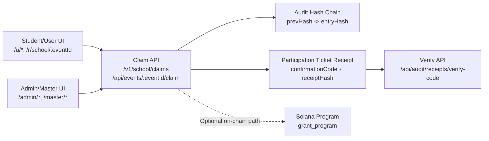
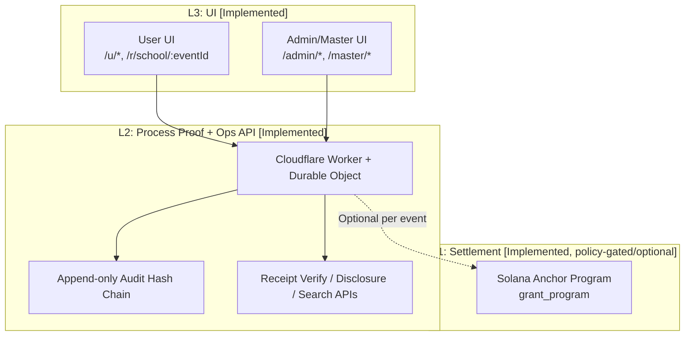

# Asuka Network Core (Prototype)

Public prototype for auditable school/public participation and grant operations using PoP (Proof of Process).

[日本語 README](./README.ja.md)

**Live URLs (We-ne)**
- User: `https://instant-grant-core.pages.dev/`
- Admin: `https://instant-grant-core.pages.dev/admin/login` (Demo login code: `83284ab4d9874e54b301dcf7ea6a6056`)

**Status as of 2026-02-22**

## Quick Navigation
- [Top Summary](#top-summary)
- [Visual Overview](#visual-overview)
- [Verification Evidence (UI)](#verification-evidence-ui)
- [What’s Implemented Now](#whats-implemented-now)
- [Architecture](#architecture)
- [Reviewer Quickstart (10 Minutes)](#reviewer-quickstart-10-minutes)
- [Verification Evidence](#verification-evidence)
- [Milestones / What Grant Funds](#milestones--what-grant-funds)

## Top Summary
- What it is: a 3-layer system that binds operational process logs to verifiable receipts, and optionally to Solana settlement.
- Who it is for: students/users who join events, and operators (admin/master) who run and audit distribution.
- [Implemented] Student/user participation can be completed walletless via off-chain participation ticket issuance (`confirmationCode` + `ticketReceipt`) on supported paths.
- [Optional] On-chain settlement evidence is an optional devnet path; tx/receipt/Explorer outputs appear only when the on-chain claim route is actually used.
- [Implemented] Accountable operator workflow: admin/master flows expose PoP/runtime status, transfer audit logs, and role-based disclosure/search.
- [Implemented] Admin participant search is owner-scoped: admin accounts search only tickets from their own issued events; master keeps full scope.
- [Implemented] UI-level PoP confirmation is available: admin events screen shows `PoP Runtime Proof` with `enforceOnchainPop` + `signerConfigured`, linked to `/v1/school/pop-status`.
- [Implemented] Hash-chain operation UI is available: admin event detail shows `Transfer Audit (Hash Chain)` with `prevHash -> entryHash` links for both on-chain and off-chain records.
- [Implemented] User evidence UI is available on success screen: `confirmationCode`, participation audit receipt (`receipt_id`, `receipt_hash`), and optional PoP proof copy actions.
- [Implemented] Admin event issuance requires authenticated operator + connected Phantom wallet + runtime readiness checks.
- [Implemented] Verifiability endpoints include `/v1/school/pop-status`, `/v1/school/runtime-status`, `/v1/school/audit-status`, and `/api/audit/receipts/verify-code`.
- Current deployment (We-ne): User `https://instant-grant-core.pages.dev/` / Admin `https://instant-grant-core.pages.dev/admin/login`.
- Maturity: prototype focused on reproducibility and reviewer-verifiable evidence, not a production-complete public system.
- Source of truth in this repo: `api-worker/src/storeDO.ts`, `wene-mobile/src/screens/user/*`, `wene-mobile/src/screens/admin/*`, `grant_program/programs/grant_program/src/lib.rs`.

## Visual Overview


## Project Direction
- [Implemented] Near-term Solana contribution: a reproducible reference implementation for accountable P2P public operations with auditable administration and verifiable receipts.
- [Implemented] Current scope is practical: student/user participation + operator workflows (admin/master) with concrete verification endpoints and UI evidence.
- [Planned] Generalize the current design toward an administration-operable federation model, so multiple institutions can operate under explicit disclosure and audit boundaries.
- [Planned] Generalize settlement interfaces toward chain-agnostic adapters in the future public infrastructure direction, while Solana remains the active implementation in this PoC.
- [Planned] This grant/PoC stage does not include launching a new independent chain.

## Stage Clarity
> - [Implemented] Off-chain Attend issues a participation ticket (`confirmationCode` + `ticketReceipt`) without requiring a wallet when policy allows.
> - [Optional] On-chain redeem/proof runs only on the on-chain path; tx signature / receipt pubkey / Explorer evidence are conditional outputs.
> - [Implemented] PoP/runtime/audit operational checks are exposed via public endpoints and shown in admin UI.
> - [Planned] Advanced anti-sybil eligibility modules, federation-ready operations, and chain-agnostic adapter design are roadmap items.

## Why This Matters
Public grants and school participation often expose only final outcomes, leaving process decisions opaque; this project addresses that by making operator actions, audit-chain integrity, and settlement-linked evidence independently verifiable.

## Verification Evidence (UI)
- [Implemented] PoP runtime proof:
  - Admin UI route: `/admin` (Events list) -> open `PoP Runtime Proof` / `PoP稼働証明` panel.
  - UI fields: `enforceOnchainPop`, `signerConfigured`, `signerPubkey`, and `verification endpoint: /v1/school/pop-status`.
  - Backing endpoint: `GET /v1/school/pop-status` (see `api-worker/src/storeDO.ts`).
  - PoP "ready" for operation is interpreted as `enforceOnchainPop=true` and `signerConfigured=true` in this panel.
- [Implemented] Transfer Audit (Hash Chain):
  - Admin UI route: `/admin/events/:eventId` -> `Transfer Audit (Hash Chain)` section.
  - Chain proof in UI: `hash: <prev> -> <current>` and `chain: <prev> -> <current>` for on-chain/off-chain records.
  - CSV export: `CSVダウンロード` button on the same event detail screen.
- [Implemented] Admin participant search scope:
  - Admin UI route: `/admin/participants`.
  - Behavior: admin accounts search only claimants from owner-issued events; master has full scope.
  - Backing APIs: `/v1/school/events?scope=mine` + `/v1/school/events/:eventId/claimants` (owner check in `api-worker/src/storeDO.ts`).
- [Restricted] Master Dashboard audit/disclosure:
  - High-privilege surface (invite codes, audit logs, admin disclosure, indexed search) in `wene-mobile/app/master/index.tsx`.
  - Public URL is intentionally not listed.
  - Local-only access: run local web app and open the master route on localhost (`/master/login`), or check route list/local run output.
  - PII handling: hidden by default (`pii: hidden`) and reveal is restricted via explicit toggle (`Show PII`) on the master screen; admin-level transfer APIs are no-PII (`strictLevel: admin_transfer_visible_no_pii` in `api-worker/src/storeDO.ts`).

## What’s Implemented Now

### Truth Table (Implemented vs Planned)
| Capability | Status | Evidence |
|---|---|---|
| `Participation Ticket (off-chain Attend)` with immutable audit receipt | `Implemented` | `api-worker/src/storeDO.ts` (`/v1/school/claims`, `/api/events/:eventId/claim`, receipt builder/verify) |
| `On-chain Redeem (optional)` with Phantom signing | `Implemented` | `wene-mobile/src/screens/user/UserConfirmScreen.tsx`, `grant_program/programs/grant_program/src/lib.rs` |
| PoP runtime/public status endpoints | `Implemented` | `/v1/school/pop-status`, `/v1/school/runtime-status`, `/v1/school/audit-status` |
| Admin participant search with owner scope | `Implemented` | `/admin/participants`, `wene-mobile/src/screens/admin/AdminParticipantsScreen.tsx`, `/v1/school/events?scope=mine`, owner check in `/v1/school/events/:eventId/claimants` (`api-worker/src/storeDO.ts`) |
| Admin transfer audit split (`onchain` vs `offchain`) | `Implemented` | `wene-mobile/src/screens/admin/AdminEventDetailScreen.tsx`, `/api/admin/transfers` |
| Master strict disclosure (`master > admin`) | `Implemented` | `/api/master/transfers`, `/api/master/admin-disclosures`, `wene-mobile/app/master/index.tsx` |
| Server-side indexed search with DO SQLite persistence | `Implemented` | `/api/master/search`, `api-worker/src/storeDO.ts` (`master_search_*` tables) |
| FairScale/advanced anti-sybil identity layer | `Planned` | `docs/ROADMAP.md` |
| Administration-operable federation model (multi-institution ops) | `Planned` | roadmap/design direction (not implemented in this repo) |
| Chain-agnostic settlement adapters (future public infrastructure) | `Planned` | roadmap direction; no independent chain launch in this grant/PoC stage |

### 1) Student/User Experience
- `Implemented`: User flow screens are present and connected: `/u/scan` → `/u/confirm` → `/u/success`.
  - Code: `wene-mobile/src/screens/user/UserScanScreen.tsx`, `wene-mobile/src/screens/user/UserConfirmScreen.tsx`, `wene-mobile/src/screens/user/UserSuccessScreen.tsx`
- `Implemented`: User registration/login by `displayName + PIN` / `userId + PIN`.
  - API: `/api/users/register`, `/api/auth/verify`
- `Implemented`: Attend creates artifacts:
  - `confirmationCode`
  - `ticketReceipt` (`receiptId`, `receiptHash`, `entryHash`, `prevHash`, `streamPrevHash`, immutable sink refs)
  - Code: `api-worker/src/storeDO.ts` (`buildParticipationTicketReceipt`, `storeParticipationTicketReceipt`)
- `Implemented`: walletless path exists, with policy conditions:
  - `/r/school/:eventId` web flow can use `joinToken` (walletless Attend)
  - `/u/*` flow can complete without wallet only when event/policy does not require on-chain proof
  - Code: `wene-mobile/src/hooks/useSchoolClaim.ts`, `api-worker/src/storeDO.ts`
- `Implemented`: `On-chain Redeem (optional)` path returns `txSignature`, `receiptPubkey`, `mint`, and PoP hashes when used.

### 2) Operator/Admin Experience
- `Implemented`: Admin login and role-based operator auth.
  - UI: `/admin/login`
  - API: `/api/admin/login`
- `Implemented`: Event issuance requires runtime readiness + wallet signing.
  - UI: runtime card and checks in `AdminCreateEventScreen`
  - API: `/v1/school/runtime-status`
- `Implemented`: Admin dashboard shows PoP runtime proof card and verification endpoint.
  - UI: `wene-mobile/src/screens/admin/AdminEventsScreen.tsx`
- `Implemented`: Admin participant search only includes tickets from owner-issued events.
  - UI: `/admin/participants` (`wene-mobile/src/screens/admin/AdminParticipantsScreen.tsx`)
  - API: `/v1/school/events?scope=mine` + owner-scoped `/v1/school/events/:eventId/claimants` in `api-worker/src/storeDO.ts`
- `Implemented`: Event detail view includes:
  - participant list + confirmation codes
  - transfer audit grouped as `On-chain署名` and `Off-chain監査署名`
  - hash-chain operation labels and links (`Transfer Audit (Hash Chain)`, `hash: <prev> -> <entry>`, `chain: <prev> -> <entry>`)
  - Code: `wene-mobile/src/screens/admin/AdminEventDetailScreen.tsx`
- `Implemented`: Master dashboard can issue/revoke/rename admin codes, inspect disclosures, and run indexed search.
  - UI: `wene-mobile/app/master/index.tsx`
  - API: `/api/admin/invite`, `/api/admin/revoke`, `/api/admin/rename`, `/api/master/admin-disclosures`, `/api/master/search`

### 3) Security / Abuse Resistance (Current + Planned)
- `Implemented`: per-subject claim gating with interval policy and `alreadyJoined` behavior.
  - Code: `api-worker/src/claimLogic.ts`
- `Implemented`: on-chain proof fields required when `ENFORCE_ONCHAIN_POP=true` and event has on-chain config.
  - API checks in `/v1/school/claims` and `/api/events/:eventId/claim`
- `Implemented`: immutable audit fail-close mode (`AUDIT_IMMUTABLE_MODE=required`) blocks mutating APIs if sink is not operational.
  - Code: `api-worker/src/storeDO.ts`
- `Implemented`: strict disclosure levels:
  - admin can view transfer identifiers without PII (`strictLevel: admin_transfer_visible_no_pii`)
  - master can view full disclosure (`strictLevel: master_full`)
- `Planned`: stronger anti-sybil/eligibility integration (e.g., FairScale-class gating).

## Architecture



```text
L3: UI (Implemented)
  - User screens: /u/* and /r/school/:eventId (RN/Web)
  - Admin/Master screens: /admin/*, /master/*
          |
          v
L2: Process Proof + Ops API (Implemented)
  - Cloudflare Worker + Durable Object
  - Append-only audit hash chain + immutable sinks
  - Receipt verify endpoints, admin/master disclosure/search
          |
          v
L1: Settlement (Implemented, policy-gated/optional per event)
  - Solana Anchor program (`grant_program`)
  - PoP-verified claim instructions + claim receipts

Dev-only optional path:
  - `wene-mobile/server/*` is a local mock API for development tests.
```

## Reviewer Quickstart (10 Minutes)

### A) Live URLs (recommended)
- User app: `https://instant-grant-core.pages.dev/`
- Admin login: `https://instant-grant-core.pages.dev/admin/login`
- [Restricted] Master dashboard URL is intentionally not listed publicly in this README.
- Local-only reviewer access: use localhost route `/master/login` after running local web app (`cd wene-mobile && npm run web`).

### B) 2-minute runtime checks
```bash
BASE="https://instant-grant-core.pages.dev"
curl -s "$BASE/health"
curl -s "$BASE/v1/school/pop-status"
curl -s "$BASE/v1/school/runtime-status"
curl -s "$BASE/v1/school/audit-status"
```
Expected:
- `/health` returns `{"ok":true}`
- `pop-status.signerConfigured=true`
- `runtime-status.ready=true`
- `audit-status.operationalReady=true`

### C) UI click path (admin login → event → print QR → scan → confirm → success)
1. Open `/admin/login` and sign in with an issued admin code (or demo/admin password provided by operator).
2. Open a `Published` event, then open `印刷用PDF` and display the QR.
3. On user app (`/u`), do register/login (`/u/register` or `/u/login`), then scan (`/u/scan`) the QR.
4. Confirm on `/u/confirm` (PIN required; Phantom required only when event policy enforces on-chain proof).
5. Land on `/u/success`.

Expected output at the end:
- Off-chain Attend evidence:
  - `confirmationCode`
  - `監査レシート（参加券）` card with `receipt_id` and `receipt_hash`
- On-chain Redeem evidence (if that path is used):
  - `txSignature` + `receiptPubkey` + `mint`
  - Explorer buttons for tx/address evidence
  - PoP proof values (`signer`, `entry_hash`, `audit_hash`)

### D) Verify ticket evidence by code
Use `eventId` + `confirmationCode` from success UI:
```bash
curl -s -X POST "$BASE/api/audit/receipts/verify-code" \
  -H "content-type: application/json" \
  -d '{"eventId":"<EVENT_ID>","confirmationCode":"<CONFIRMATION_CODE>"}'
```
Expected: `ok=true` and a `verification.checks` object with chain/hash validations.

### E) Common failure modes and misconfiguration signals
- `runtime-status.ready=false`:
  - Check `blockingIssues` for `ADMIN_PASSWORD`, PoP signer, or immutable sink setup.
- `PoP signer not configured` / `PoP署名者公開鍵...`:
  - Check `POP_SIGNER_*` worker secrets and `EXPO_PUBLIC_POP_SIGNER_PUBKEY`.
- `on-chain claim proof required` / `wallet_required`:
  - Event is on-chain-configured + enforcement is on; wallet+proof fields are missing.
- `401 Unauthorized` on `/api/admin/*` or `/api/master/*`:
  - Missing/invalid bearer token for admin/master routes.

### F) Local run (minimal reproducibility)
```bash
cd api-worker && npm ci && npm test && npx tsc --noEmit
cd ../wene-mobile && npm ci && npm run test:server && npx tsc --noEmit
```

## Verification Evidence

### 1) Off-chain evidence `[Implemented]`
From `/u/success` after Attend:
- `confirmationCode`
- `監査レシート（参加券）` (`receipt_id`, `receipt_hash`)
- copy payload includes `verify_api: /api/audit/receipts/verify-code`

Verify by code:
```bash
curl -s -X POST "https://instant-grant-core.pages.dev/api/audit/receipts/verify-code" \
  -H "content-type: application/json" \
  -d '{"eventId":"<EVENT_ID>","confirmationCode":"<CONFIRMATION_CODE>"}'
```
Expected: `ok=true` with chain/hash checks in `verification.checks`.

### 2) On-chain evidence `[Optional]`
Only when on-chain path is actually executed in `wene-mobile/src/screens/user/UserConfirmScreen.tsx`:
- success UI shows `txSignature`, `receiptPubkey`, optional `mint`, PoP values
- Explorer links appear only when those values exist

Explorer format:
- Tx: `https://explorer.solana.com/tx/<signature>?cluster=devnet`
- Receipt/Mint: `https://explorer.solana.com/address/<pubkey>?cluster=devnet`

### 3) PoP/runtime operational status `[Implemented]`
Admin UI route:
- `/admin` events list shows `PoP稼働証明` card in `wene-mobile/src/screens/admin/AdminEventsScreen.tsx`
- card displays `verification endpoint: /v1/school/pop-status`

Runtime/API checks:
```bash
curl -s https://instant-grant-core.pages.dev/v1/school/pop-status
curl -s https://instant-grant-core.pages.dev/v1/school/runtime-status
curl -s https://instant-grant-core.pages.dev/v1/school/audit-status
```
Interpretation:
- `pop-status.enforceOnchainPop=true` and `pop-status.signerConfigured=true` indicates on-chain PoP enforcement is configured.
- `runtime-status.ready=true` means operational prerequisites are satisfied.
- `audit-status.operationalReady=true` means immutable sink path is available.
- `audit-integrity.ok=true` confirms recent chain integrity checks:
```bash
curl -s -H "Authorization: Bearer <MASTER_PASSWORD>" \
  "https://instant-grant-core.pages.dev/api/master/audit-integrity?limit=50"
```

### 4) Where evidence appears in UI
- PoP runtime evidence card:
  - `wene-mobile/src/screens/admin/AdminEventsScreen.tsx`
  - labels include `PoP稼働証明` and endpoint `/v1/school/pop-status`
- Hash-chain operation + on/off-chain transfer separation:
  - `wene-mobile/src/screens/admin/AdminEventDetailScreen.tsx`
  - labels include `送金監査 (Hash Chain)`, `On-chain署名`, `Off-chain監査署名`, and chain display (`hash: ... -> ...`, `chain: ... -> ...`)
- Participation ticket evidence card and copy action:
  - `wene-mobile/src/screens/user/UserSuccessScreen.tsx`

## Milestones / What Grant Funds

| Milestone | Deliverable | Success Criteria | Reviewer-verifiable Evidence |
|---|---|---|---|
| M1: Reproducibility + Evidence (10-minute review) | [Implemented] Reviewer runbook for live + local verification with explicit evidence points | A reviewer can verify runtime status + ticket evidence in about 10 minutes without hidden setup | This README + `/v1/school/pop-status` + `/v1/school/runtime-status` + `/api/audit/receipts/verify-code` |
| M2: Accountability Strengthening | [Implemented] Ops evidence surfaces (`PoP稼働証明`, `Transfer Audit (Hash Chain)`, transfer on/off-chain split, role-based disclosures); [Implemented] integrity check API (`/api/master/audit-integrity`) | Operators can inspect process evidence and auditors can run integrity checks with master auth | `wene-mobile/src/screens/admin/AdminEventsScreen.tsx`, `wene-mobile/src/screens/admin/AdminEventDetailScreen.tsx`, `wene-mobile/app/master/index.tsx`, `api-worker/src/storeDO.ts` |
| M3: Federation-ready Generalization | [Planned] Doc-level federation model + minimal PoC hooks for chain-agnostic adapter boundaries (not a new chain launch) | Design docs and adapter/federation interfaces are explicit and testable without changing current Solana reference path | `docs/ROADMAP.md` + future PRs for adapter/federation interfaces |

## Scope Clarity

> **In scope for this repo / this grant**
> - Reproducible school participation flow
> - `Participation Ticket (off-chain Attend)` with immutable audit receipt
> - Policy-gated `On-chain Redeem (optional)`
> - Admin/master auditability, disclosure separation, and verification endpoints
>
> **Out of scope (planned)**
> - Full walletless on-chain settlement for every event policy
> - Production federation rollout across institutions/municipalities (design generalization only in this stage)
> - Launching a new independent chain in this grant/PoC stage

## Links and Docs
- Architecture: `docs/ARCHITECTURE.md`
- Security: `docs/SECURITY.md`
- Roadmap: `docs/ROADMAP.md`
- Devnet setup: `docs/DEVNET_SETUP.md`
- Worker API details: `api-worker/README.md`
- UI verification report: `wene-mobile/docs/STATIC_VERIFICATION_REPORT.md`

### Reviewer Shortcut (source of truth files)
- `api-worker/src/storeDO.ts`
- `api-worker/src/claimLogic.ts`
- `grant_program/programs/grant_program/src/lib.rs`
- `wene-mobile/src/screens/user/UserConfirmScreen.tsx`
- `wene-mobile/src/screens/user/UserSuccessScreen.tsx`
- `wene-mobile/src/screens/admin/AdminEventsScreen.tsx`
- `wene-mobile/src/screens/admin/AdminEventDetailScreen.tsx`
- `wene-mobile/app/master/index.tsx`

## License
MIT
