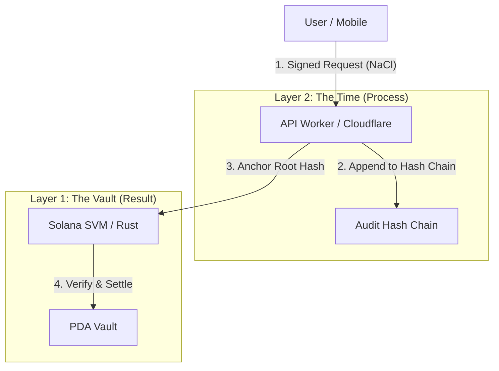

# Asuka Network Core (Prototype)
> **Public Blockchain Protocol based on Proof of Process (PoP), Auditable & Made in Japan**

[]
[]
[]
[]

## ⚡ Live Demo (We-ne)
The first reference implementation for government and public sectors running on Asuka Network, "We-ne", is available to experience directly from your browser.
No installation required. Experience the lightning-fast approval process powered by the edge.

[🚀 **Launch We-ne (Web App)**](https://instant-grant-core.pages.dev/)

[🚀 **Launch We-ne (Web admin App)**](https://instant-grant-core.pages.dev/admin/login)

---

## 📖 Project Overview
**Asuka Network** is a next-generation public infrastructure protocol designed to solve "Process Opacity" in administrative procedures and grant distributions.

Existing public blockchains guarantee the integrity of "results (balance transfers)", but the "process (how the transaction was generated)" has remained a black box.
This project proposes and implements a new consensus concept called **"Proof of Process (PoP)"**, where Web2-style API logs are carved into an irreversible hash chain and mathematically bound to on-chain settlements.

## 📌 Current AsukaNetwork Status (Feb 21, 2026)

- Runtime mode is **devnet-first** (current app runtime is fixed to Solana devnet).
- Process-proof layer is active on Cloudflare Workers:
  - API audit logs are chained with a global hash chain (`prev_hash`).
  - Per-event continuity is also preserved (`stream_prev_hash`).
  - Audit entries are persisted to immutable sinks outside Durable Object storage (R2 content-addressed objects and optional immutable-ingest webhook), with fail-closed mode (`AUDIT_IMMUTABLE_MODE=required`) for mutating APIs.
- Operator security hardening is active:
  - Admin-protected school APIs require Bearer authentication.
  - Master-only APIs reject the default placeholder password and require a real `ADMIN_PASSWORD`.
- Public demo delivery is active:
  - User app: `https://instant-grant-core.pages.dev/`
  - Admin app: `https://instant-grant-core.pages.dev/admin/login`
- PoP settlement binding is active on Layer 1:
  - `claim_grant` / `claim_grant_with_proof` enforce on-chain PoP verification.
  - Ed25519 pre-instruction, authorized PoP signer (`pop_config`), and hash-chain continuity (`pop_state`) are validated on-chain.
  - PoP v2 includes API audit-anchor hash in the signed message, and entry hash derivation is re-computed and checked on-chain.

## 🏗 Architecture: Trinity of Trust
This repository defines "accountability" in code through the following three-layer structure (Trinity Architecture).

Current implementation status by layer:

- Layer 1 (Solana settlement/claim): Implemented with mandatory PoP verification in claim instructions (ed25519 + authorized signer + chain continuity + proof freshness checks).
- Layer 2 (API process proof): Implemented (global hash chain + per-event stream chain + PoP proof issuance signed with audit-anchor binding + operator auth controls).
- Layer 3 (User/Admin interface): Implemented (web/mobile UX, Phantom signing/deeplink flow, admin session guard).
- Edge proxy for Pages delivery: Implemented in `functions/[[path]].ts` and `wene-mobile/functions/[[path]].ts` for `/api/*`, `/v1/*`, `/metadata/*`, and `/health`.



### 1. Layer 1: The Vault (Guarantee of Result)
* **Tech Stack:** Rust, Anchor Framework (Solana SVM)
* **Role:** Storage of value and settlement finality.
* **Innovation:** Uses **PDA (Program Derived Address)** deterministic seed generation to prevent "Double-Spending" at a physical law level, without relying on databases.
* [📂 View Contract Code](./grant_program)

### 2. Layer 2: The Time (Proof of Process)
* **Tech Stack:** TypeScript, Cloudflare Workers (Edge Computing)
* **Role:** Auditor of time and process.
* **Innovation:** Generates an **Append-only Hash Chain** in real-time for every request, including global previous hash (`prev_hash`) and per-event stream linkage (`stream_prev_hash`).
    * Audit entries are also mirrored to immutable sinks outside DO (`AUDIT_LOGS` R2 and optional immutable ingest endpoint), so in-DO rewrites can be detected and rejected.
* [📂 View API Code](./api-worker)

### 3. Layer 3: The Interface (Protection of Intent)
* **Tech Stack:** React Native, React Native Web, NaCl
* **Role:** Sovereign interface for citizens.
* **Innovation:** Uses **NaCl (Curve25519)** for End-to-End Encryption (E2EE) to completely protect user signatures (intent) from Man-in-the-Middle attacks until they reach the protocol. Deployed as a censorship-resistant PWA.
* [📂 View Mobile Code](./wene-mobile)

### 3.5. Edge Delivery Proxy (Cloudflare Pages Functions)
* **Tech Stack:** Cloudflare Pages Functions (`[[path]].ts`)
* **Role:** Runtime proxy between Pages-hosted UI and Worker API.
* **Implementation:** `functions/[[path]].ts` (root) and `wene-mobile/functions/[[path]].ts` proxy `/api/*`, `/v1/*`, `/metadata/*`, and `/health` to the Worker origin.

## 🦁 Philosophy: Beyond Winny
Peer-to-Peer (P2P) technology once aimed for "freedom without administrators", but what society demanded was "trust with clear accountability".
Asuka Network inherits the autonomous decentralized philosophy of P2P while implementing **complete auditability via "Proof of Process"**, aiming to become a domestic digital public infrastructure that government and public services can rely on with confidence.

## 🛠 Roadmap (Goals during Mitou Period)
- [x] **Phase 1: Genesis (Completed)**
    - Integrated implementation of SVM contract (Rust) and Edge Hash Chain (TS).
    - Deployment of MVP app "We-ne" as PWA.
- [x] **Phase 2: Gating (Completed)**
    - L1 now forcibly rejects claim transactions that do not contain a valid API-issued PoP proof.
- [ ] **Phase 3: Federation**
    - Expansion to a consortium model where municipalities and public institutions can participate as nodes.

## 👨💻 Author
**Kira (hk089660)**
* 19 years old. Asuka Network Architect.
* *Driven by the legacy of Winny, powered by modern cryptography.*

---

## We-ne Reference Implementation (instant-grant-core)

We-ne is an open-source prototype/evaluation kit for verifying non-custodial aid distribution and participation ticket operations on Solana. It emphasizes third-party verifiability using receipt records and prevention of duplicate reception.

> Status (as of Feb 20, 2026): **PoC / devnet-first**. This is for reproducibility and evaluation verification, not for production mainnet operation.

[Japanese README](./README.ja.md) | [Architecture](./docs/ARCHITECTURE.md) | [Devnet Setup](./docs/DEVNET_SETUP.md) | [Security](./docs/SECURITY.md)

## Repository Structure (Current)

- `grant_program/`: Solana program (Anchor, Layer 1).
- `api-worker/`: Cloudflare Worker API and hash-chain audit logic (Layer 2).
- `wene-mobile/`: User/Admin app (Expo, Web + Mobile UI, Layer 3).
- `functions/` and `wene-mobile/functions/`: Cloudflare Pages Functions proxy layer (`/api`, `/v1`, `/metadata`, `/health` -> Worker).
- `scripts/build-all.sh`: root reproducible build/test helper (`build`, `test`, `all`) used for third-party verification.

## What this prototype solves

- Non-custodial on-chain distribution: wallet-connected users sign with their own wallets; the app does not hold private keys.
- Wallet-optional participation: users without Phantom can still complete participation via off-chain flow.
- Auditability: tx/receipt records can be independently verified on Solana Explorer.
- Duplicate Prevention: Receipt logic enforces single reception; re-application in the school flow is treated as `already joined` (operation complete) rather than a double payment.

## Current PoC Status

- Devnet E2E claim flow available (wallet sign -> send -> Explorer verification).
- School event QR flow available (`/admin/login` -> `/admin` -> Print QR -> `/u/scan` -> `/u/confirm` -> `/u/success`).
- Success screen shows tx signature + receipt pubkey + mint link on Solana Explorer (devnet).
- Re-application is treated as `already joined` (operation complete), no double payment.

## Current We-ne Progress (Feb 20, 2026)

- Admin operation:
  - `/admin/*` is session-guarded; unauthorized access is redirected to `/admin/login`.
  - Admin login supports master password, issued admin invite codes, and optional demo password.
- Event issuance:
  - Each event issuance creates an independent SPL mint on devnet.
  - Token metadata name follows the event title and is served from `/metadata/<mint>.json`.
  - Claim policy is configurable per event (`claimIntervalDays`, `maxClaimsPerInterval`).
- User claim:
  - `UserConfirmScreen` supports on-chain claim when wallet + on-chain config are available.
  - If wallet/on-chain config is unavailable, off-chain claim flow still works.
  - Explorer links for tx/receipt/mint are displayed on success screen.
- API audit and auth:
  - Admin-only APIs (`POST /v1/school/events`, `GET /v1/school/events/:eventId/claimants`) are authenticated.
  - Audit logs are chained globally and can be inspected from master dashboard APIs.

## Latest Security & Audit Updates (Feb 20, 2026)

- Admin-only school routes now require Bearer operator authentication:
  - `POST /v1/school/events`
  - `GET /v1/school/events/:eventId/claimants`
- Master-only APIs now reject the default placeholder password (`change-this-in-dashboard`). A real `ADMIN_PASSWORD` must be set.
- API audit logs are now chained globally (`prev_hash`) across admin/user/system APIs, while keeping per-event stream linkage (`stream_prev_hash`) for drill-down.
- Admin demo flow is preserved, but direct UI bypass is removed:
  - Demo button now performs API login using `EXPO_PUBLIC_ADMIN_DEMO_PASSWORD`.
  - `/admin/*` routes are session-guarded and redirect unauthorized users to `/admin/login`.
  - Admin API client always attaches `Authorization` and clears session on `401`.
- Local dev server CORS now allows `Authorization` header for parity with production behavior.

### Required Configuration for These Updates

- Cloudflare Worker vars (`api-worker`):
  - `ADMIN_PASSWORD`: required, and must not be `change-this-in-dashboard`.
  - `ADMIN_DEMO_PASSWORD`: optional (only for demo admin login).
- App env (`wene-mobile`):
  - `EXPO_PUBLIC_ADMIN_DEMO_PASSWORD`: required only if you want the demo login button to work.

## Trust Layer: Participation & Eligibility Gating via FairScale

Status: Planned

- FairScale is planned to be introduced as a trust signal for abuse resistance (Sybil pressure countermeasures), not just a cosmetic label.
- Planned gating points are before claim acceptance at `POST /v1/school/claims` and before server-side issuance/verification of participant identification tokens.
- Currently valid code gates are event state qualification (`published` only) and duplicate entity check by `walletAddress` / `joinToken` (returns `alreadyJoined` on duplicate, not double payment).
- Runtime integration of FairScale is unimplemented; milestones are listed in `./docs/ROADMAP.md` (`FairScale Integration`) and referenced as planned in `./docs/SECURITY.md`.
- As an abuse deterrence effect, combining on-chain receipt control with off-chain eligibility gating reduces duplicate claim paths while maintaining non-custodial onboarding.
- Current review verification involves running `cd wene-mobile && npm run test:server` and `cd api-worker && npm test` to confirm `eligibility` / `alreadyJoined` behavior at `/v1/school/claims`.

Reviewer shortcut: Check `./wene-mobile/server/routes/v1School.ts`, `./api-worker/src/claimLogic.ts`, `./docs/SECURITY.md`, and `./docs/ROADMAP.md`.

Why it matters for Solana Foundation / Instagrant: It is an element to achieve both permissionless onboarding with auditability and stronger abuse resistance.

## Camera/QR Scan Implementation Status

Status: Implemented (PoC)

- Currently Working: Admin print screen (`/admin/print/<eventId>`) generates QR for `/u/scan?eventId=<eventId>`, printable/PDF export.
- Currently Working: User screen `/u/scan` implements QR reading with camera permission handling (in-app decode).
- Currently Working: Extract `eventId` from QR string and navigate to `/u/confirm?eventId=...`.
- Currently Working: Web uses `@zxing/browser` for reading (fallback even for non-BarcodeDetector browsers).
- Current Limitations: Scan fallback is URL-based (defaults to `evt-001` if `eventId` is unspecified), prioritizing PoC demo reproducibility.
- Current Reviewer Test: Confirm `/u/scan -> /u/confirm -> /u/success` and Explorer link following current Demo steps.

Reviewer shortcut: Check `./wene-mobile/src/screens/user/UserScanScreen.tsx` and `./wene-mobile/src/screens/admin/AdminPrintScreen.tsx`.

### Roadmap (Until PoC Completion)

- Milestone 1 (`Status: Completed`): Implement actual scan processing (QR decode + permission handling) at `/u/scan`.
- Milestone 2 (`Status: Planned`): Add `eventId` manual entry fallback + expired/invalid QR messages, and fix via UI/API tests.

## 🔗 Deployment Flow (Current)
Use the following order for a clean deployment path.

### Step 1: Layer 1 (Solana Program)
1. Go to `grant_program/`.
2. Build and deploy to Devnet.
3. If you changed the program, note the generated Program ID and update `wene-mobile/src/solana/config.ts`.

### Step 2: Layer 2 (API Worker)
1. Go to `api-worker/`.
2. Configure Worker vars:
   - `ADMIN_PASSWORD` (required, non-default)
   - `ADMIN_DEMO_PASSWORD` (optional, demo login only)
   - `CORS_ORIGIN` (recommended)
   - `POP_SIGNER_SECRET_KEY_B64` (required for on-chain PoP proof signing)
   - `POP_SIGNER_PUBKEY` (required; corresponding Ed25519 public key in base58)
   - `ENFORCE_ONCHAIN_POP` (recommended: `true`; default is enforced when omitted)
   - `AUDIT_IMMUTABLE_MODE` (recommended: `required`; `best_effort` / `off` also supported)
   - `AUDIT_IMMUTABLE_INGEST_URL` (optional second immutable sink webhook)
   - `AUDIT_IMMUTABLE_INGEST_TOKEN` (optional bearer token for immutable ingest webhook)
   - `AUDIT_IMMUTABLE_FETCH_TIMEOUT_MS` (optional, default `5000`)
3. Configure Worker bindings:
   - `AUDIT_LOGS` (R2 bucket, required when running immutable mode in production)
   - `AUDIT_INDEX` (KV, optional metadata index for fast lookup)
4. Deploy to Cloudflare Workers.
5. Copy your Worker's URL (canonical: `https://instant-grant-core.haruki-kira3.workers.dev`).
6. Verify PoP runtime status:
   - `GET /v1/school/pop-status` should return `enforceOnchainPop: true` and `signerConfigured: true`.
7. Verify audit runtime status:
   - `GET /v1/school/audit-status` should return `operationalReady: true`.
   - `GET /api/master/audit-integrity?limit=50` (with Master token) should return `ok: true`.
8. Verify production readiness:
   - `GET /v1/school/runtime-status` should return `ready: true`.
   - In `AUDIT_IMMUTABLE_MODE=required`, mutating APIs are now preflight-blocked with `503` when immutable sinks are not operational.
9. Run end-to-end readiness check:
   - `npm run verify:production`
   - Optional (master integrity check): `MASTER_TOKEN=<admin_password> npm run verify:production`

### Step 3: Pages Proxy Layer (`functions/` + `_redirects`)
1. Confirm proxy files are deployed with the site:
   - `functions/[[path]].ts`
   - `wene-mobile/functions/[[path]].ts`
2. Build web artifacts with API base env:
   - Preferred: `EXPO_PUBLIC_SCHOOL_API_BASE_URL`
   - Compatible fallback: `EXPO_PUBLIC_API_BASE_URL`
3. Ensure generated `dist/_redirects` includes proxy rules for `/api/*`, `/v1/*`, and `/metadata/*`.

### Step 4: Layer 3 (Mobile/Web App)
1. Go to `wene-mobile/`.
2. Create `.env` from `.env.example`.
3. Set app envs:
   - `EXPO_PUBLIC_SCHOOL_API_BASE_URL` = Worker URL (preferred)
   - `EXPO_PUBLIC_API_BASE_URL` = Worker URL (compatibility fallback)
   - `EXPO_PUBLIC_BASE_URL` = Pages domain (recommended for print/deeplink UX)
   - `EXPO_PUBLIC_POP_SIGNER_PUBKEY` = same value as Worker `POP_SIGNER_PUBKEY` (required for admin issuance)
   - `EXPO_PUBLIC_ENFORCE_ONCHAIN_POP` = `true` (recommended for production; on-chain configured events require wallet + PoP evidence)
   - `EXPO_PUBLIC_ADMIN_DEMO_PASSWORD` (only if demo login button is used)
4. Run `npm install` (patches for web3.js will apply automatically).
5. Start the app.

## Quick Start (Local)

Option A (UI + local API in `wene-mobile`):

```bash
cd wene-mobile
npm i
npm run dev:full
```

Check after startup:

- Admin Login: `http://localhost:8081/admin/login`
- User Scan Flow: `http://localhost:8081/u/scan?eventId=evt-001`

Option B (root reproducible build/test helper):

```bash
chmod +x scripts/build-all.sh
./scripts/build-all.sh all
```

`scripts/build-all.sh` runs:
- `build`: Anchor build + mobile TypeScript check
- `test`: Anchor tests
- `all`: build + test + mobile typecheck (default)

## Quick Start (Cloudflare Pages)

Cloudflare Pages configuration for this monorepo:

- Root directory: `wene-mobile`
- Build command: `npm ci && npm run export:web`
- Output directory: `dist`

Prerequisites for `export:web`:

- Set Worker URL to `EXPO_PUBLIC_SCHOOL_API_BASE_URL` (preferred) or `EXPO_PUBLIC_API_BASE_URL` (fallback).
- If unset, `scripts/gen-redirects.js` will fail. If proxy redirects are not generated, `/api/*` and `/v1/*` may hit Pages directly and return `405` or HTML.
- `npm run deploy:pages` deploys to `instant-grant-core` by default.
  - Override with `PAGES_PROJECT_NAME=<your-pages-project> npm run deploy:pages`.
- `npm run verify:pages` checks `https://instant-grant-core.pages.dev` by default.
  - Override with `PAGES_BASE_URL=https://<your-pages-domain> npm run verify:pages`.

Copy-paste Deploy Command:

```bash
cd wene-mobile
EXPO_PUBLIC_SCHOOL_API_BASE_URL="https://instant-grant-core.haruki-kira3.workers.dev" npm run export:web
npm run deploy:pages
npm run verify:pages
```

## Demo / Reproduction Steps (1 Page)

1. Open Admin Login: `/admin/login` and authenticate.
2. Open Admin Event List: `/admin`.
3. Open Event Details: `/admin/events/<eventId>` (e.g., `evt-001`, state `published` recommended).
4. Navigate to Print Screen from "Print PDF" in details: `/admin/print/<eventId>`.
5. Confirm Print QR link points to `/u/scan?eventId=<eventId>`.
6. Open QR URL on User side -> `/u/confirm?eventId=<eventId>` -> claim -> `/u/success?eventId=<eventId>`.
7. Confirm Explorer links for tx signature and receipt pubkey on Success screen:
- `https://explorer.solana.com/tx/<signature>?cluster=devnet`
- `https://explorer.solana.com/address/<receiptPubkey>?cluster=devnet`
8. Claim again with same QR: Expected behavior is `already joined` (operation complete), no double payment.

## Verification Commands

Pages Verification Chain:

```bash
cd wene-mobile
npm run export:web
npm run deploy:pages
npm run verify:pages
```

Check items for `verify:pages`:

- Bundle SHA256 for `/admin` matches local `dist`.
- `GET /v1/school/events` returns `200` and `application/json`.
- `POST /api/users/register` is **NOT `405 Method Not Allowed`**.

Manual Spot Check:

```bash
BASE="https://<your-pages-domain>"

curl -sS -D - "$BASE/v1/school/events" -o /tmp/wene_events.json | sed -n '1p;/content-type/p'
curl -sS -o /dev/null -w '%{http_code}\n' -X POST \
  -H 'Content-Type: application/json' \
  -d '{}' \
  "$BASE/api/users/register"
```

## Troubleshooting / Known Behaviors

- `/v1/school/events` returns HTML: `_redirects` proxy not applied, or wrong artifact deployed.
- Direct fetch of `/_redirects` returns 404: Normal for Pages. Check runtime behavior if `/v1` is JSON or `/api` is non-405.
- Login/User state is assumed to be held in browser or device storage. Private browsing recommended for shared device testing.
- Web `/u/scan` camera scan is implemented (PoC), but may fail depending on browser/device permissions or compatibility. To maximize demo reproducibility, we recommend scanning the printed QR with a smartphone camera/QR reader to open `/u/scan?eventId=<eventId>`.

## Detailed Documentation

- School PoC guide: `wene-mobile/README_SCHOOL.md`
- Cloudflare Pages deployment notes: `wene-mobile/docs/CLOUDFLARE_PAGES.md`
- Worker API details: `api-worker/README.md`
- Devnet setup: `docs/DEVNET_SETUP.md`

## Context for Judges

This repository is a **reproduction/evaluation kit** for grant/PoC review. Please prioritize checking **reproducibility** and **independent verification** (especially Explorer evidence) over feature marketing.
