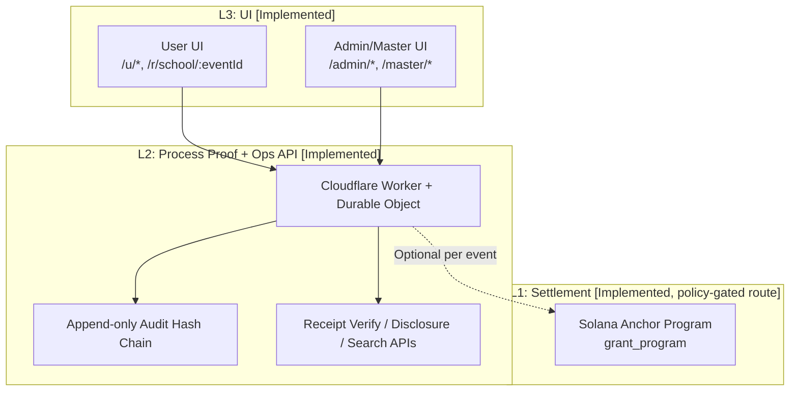

# Asuka Network Core (Prototype)

Public prototype for auditable school/public participation and grant operations using PoP (Proof of Process).

[日本語 README](./README.ja.md)

**Live URLs (We-ne)**
- User: `https://instant-grant-core.pages.dev/`
- Admin: `https://instant-grant-core.pages.dev/admin/login` (Demo login code: `83284ab4d9874e54b301dcf7ea6a6056`)

**Status (as of February 25, 2026 / 2026-02-25)**

## 💡 Technical Approach in Implementation

This prototype adopts the following architecture to solve practical challenges in real-world deployment (such as school or public events), specifically the "user onboarding barrier" and "administrator audit requirements":

### 1. Decoupling Solana Settlement from Walletless Authentication (Attend)

*   **Implementation challenge:** Forcing all participants to create a wallet (manage private keys) and hold SOL for gas upfront is a major UX barrier.
*   **Our approach:** We leverage Solana's native capability to **separate the Signer from the Fee Payer** alongside our proprietary off-chain API (Cloudflare Worker). When event policy permits, users can obtain off-chain "participation evidence" (`confirmationCode` + `ticketReceipt`) using only a unique PIN and a QR code, completely walletless.
*   **Result:** This architecture provides a seamless, Web2-like UX for general users while maintaining the flexibility to transition to on-chain settlement (Redeem) only when the explicit layer demands it.

### 2. PII Protection and Hash Chain Auditability (Proof of Process)

*   **Implementation challenge:** Fully transparent accountability for grants and participation records would expose Personally Identifiable Information (PII) on a public blockchain.
*   **Our approach:** We isolate all detailed data and receipt information (including admin/user PII) in an off-chain layer (Durable Objects). We then construct an **append-only Hash Chain** of this data. When the on-chain route is executed, only the tamper-proof hash is cryptographically linked to the Solana transaction signature (**Proof of Process: PoP**).
*   **Result:** This design enables low-cost, complete post-facto verification by third parties of "who approved what" without relying on computationally expensive cryptography like Zero-Knowledge Proofs (ZKP).

## Spec Freeze (as of 2026-02-22)
- In the current `grant_program`, both `claim_grant` and `claim_grant_with_proof` call `verify_and_record_pop_proof`, so PoP verification is always required inside on-chain claim instructions.
- In this README, `optional/required` refers to whether operations enforce the on-chain route. It does not mean PoP verification itself is switchable inside contract claims.
- A contract-level PoP on/off flag is a next-phase extension and is not implemented in the current codebase.

## Quick Navigation
- [Spec Freeze (PoP Required vs Optional Scope)](#spec-freeze-as-of-2026-02-22)
- [Verification Scope (Ops Audit vs Independent Crypto Verification)](#verification-scope-ops-audit-vs-independent-crypto-verification)
- [How to Verify (Independent / Server-Untrusted)](#how-to-verify-independent--server-untrusted)
- [PoP Chain Recovery Runbook](#pop-chain-recovery-runbook)
- [Trust Assumption (Prototype Centralization)](#trust-assumption-prototype-centralization)
- [Decentralization Milestones (Planned)](#decentralization-milestones-planned)
- [Pilot Plan (Anonymous OK)](#pilot-plan-anonymous-ok)
- [Top Summary](#top-summary)
- [Reviewer Evidence Highlights](#reviewer-evidence-highlights)
- [Visual Overview](#visual-overview)
- [Verification Evidence (UI)](#verification-evidence-ui)
- [What’s Implemented Now](#whats-implemented-now)
- [Architecture](#architecture)
- [Reviewer Quickstart (10 Minutes)](#reviewer-quickstart-10-minutes)
- [Verification Evidence](#verification-evidence)
- [Milestones / What Grant Funds](#milestones--what-grant-funds)

## Top Summary
- What it is: a 3-layer system that binds operational process logs to verifiable receipts, with policy-controlled enforcement of the on-chain route.
- Who it is for: students/users who join events, and operators (admin/master) who run and audit distribution. Initial pilot realism is defined as one institution with `admin 1-3` operators and `20-200` participants.
- [Implemented] Student/user flow has two policy-gated modes: walletless off-chain Attend (`confirmationCode` + `ticketReceipt`) and wallet-signed on-chain Redeem (only when event policy requires on-chain proof).
- [Implemented] On-chain settlement evidence on devnet is available, and route enforcement is policy-gated. When the on-chain route executes, `grant_program` claim instructions require PoP-linked evidence (tx/receipt/Explorer chain).
- [Implemented] Accountable operator workflow: admin/master flows expose PoP/runtime status, transfer audit logs, and role-based disclosure/search.
- [Implemented] Admin participant search is owner-scoped: admin accounts search only tickets from their own issued events; master keeps full scope.
- [Implemented] UI-level PoP confirmation is available: admin events screen shows `PoP Runtime Proof` with `enforceOnchainPop` + `signerConfigured`, linked to `/v1/school/pop-status`.
- [Implemented] Hash-chain operation UI is available: admin event detail shows `Transfer Audit (Hash Chain)` with `prevHash -> entryHash` links for both on-chain and off-chain records.
- [Implemented] Master audit/disclosure is constrained and explicit: sensitive fields are hidden by default (`pii: hidden`) and only revealed via explicit `Show PII` action on master screen.
- [Implemented] User evidence UI is available on success screen: `confirmationCode`, participation audit receipt (`receipt_id`, `receipt_hash`), and optional PoP proof copy actions.
- [Implemented] Admin event issuance requires authenticated operator + connected Phantom wallet + runtime readiness checks.
- [Implemented] Verifiability endpoints include `/v1/school/pop-status`, `/v1/school/runtime-status`, `/v1/school/audit-status`, and `/api/audit/receipts/verify-code`.
- [Implemented] API-level anti-bot/DDoS guardrails are active: endpoint/global rate limits, escalating temporary blocks, and payload size limits (`429` with `Retry-After`, `413` on oversized payloads).
- [Implemented] FairScale risk-gated sybil checks are integrated for register/claim paths (configurable fail-closed/fail-open), and admin abuse controls include daily issuance limits for events and admin invite codes.
- [Implemented] CI runs localnet `anchor test --skip-build --provider.cluster localnet` in addition to `anchor build`, so minimal contract integration tests are automatically verified.
- [Implemented] Node dependencies are standardized on `npm`, and `npm ci` is the canonical install path. Canonical lockfiles are `package-lock.json` at root / `grant_program` / `api-worker` / `wene-mobile`.
- [Implemented] CI fails on `yarn.lock` / `pnpm-lock.yaml` / non-canonical lockfile names (for example `package-lock 2.json`) to prevent reproducibility drift.
- [Planned] To avoid “too-early” review outcomes, one anonymous-allowed pilot is now a fixed milestone with a one-page onboarding flow (`docs/PILOT_ONBOARDING_FLOW.md`).
- Independent verification procedure: see `How to Verify (Independent / Server-Untrusted)` for fixed on-chain state + proof checks.
- PoP failure recovery: `docs/POP_CHAIN_OPERATIONS.md` defines reset/fork handling/stream-cut operations.
- Trust assumption: current PoC intentionally uses a single `PoP signer` and effectively single-operator model, with decentralization staged in the next phase.
- Current deployment (We-ne): User `https://instant-grant-core.pages.dev/` / Admin `https://instant-grant-core.pages.dev/admin/login`.
- Maturity: prototype focused on reproducibility and reviewer-verifiable evidence, not a production-complete public system.
- Source of truth in this repo: `api-worker/src/storeDO.ts`, `wene-mobile/src/screens/user/*`, `wene-mobile/src/screens/admin/*`, `grant_program/programs/grant_program/src/lib.rs`.

## Reviewer Evidence Highlights
- Walletless student path:
  - `/r/school/:eventId` can complete Attend walletless via `joinToken`.
  - `/u/*` can complete walletless only when event policy does not enforce on-chain proof.
- PoP runtime proof (UI + endpoint):
  - UI route: `/admin` -> `PoP Runtime Proof` card.
  - Expected visible fields: `enforceOnchainPop`, `signerConfigured`, `signerPubkey`, `checkedAt`, and endpoint `/v1/school/pop-status`.
- Hash-chain transfer audit:
  - UI route: `/admin/events/:eventId` -> `Transfer Audit (Hash Chain)`.
  - Expected visible chain evidence: `hash: <prev> -> <current>` and `chain: <prev> -> <current>`.
- Master audit/disclosure with PII control:
  - UI code path: `wene-mobile/app/master/index.tsx` (public URL intentionally not listed).
  - PII is hidden by default (`pii: hidden`) and requires explicit `Show PII` toggle.

## Verification Scope (Ops Audit vs Independent Crypto Verification)
- `Ops audit (UI/API)`: validate operational status through admin/master screens and `/v1/school/*`, `/api/*` responses. Strong for observability, but it includes trust in `api-worker` and UI surfaces.
- `Independent crypto verification (L1)`: validate claim correctness using only Solana transaction/account state, without trusting server/UI output. In this README, “third-party independently verifiable” refers to this path.
- `off-chain Attend` (`confirmationCode + ticketReceipt`) can be checked through public receipt APIs, but that is not equivalent to trust-minimized L1-only verification.

## How to Verify (Independent / Server-Untrusted)
Prerequisite: use a successful on-chain path result (`txSignature`, `receiptPubkey`, `mint`).

1. Fetch the transaction via Solana RPC (`getTransaction`) or Explorer using `txSignature`.
2. Validate instruction order:
   - an Ed25519 verify instruction exists immediately before the claim instruction.
   - the claim instruction program is `grant_program` (`declare_id!` in `grant_program/programs/grant_program/src/lib.rs`).
3. Validate PoP signer linkage:
   - `pop-config` PDA (seed: `["pop-config", authority]`) `signer_pubkey` matches the Ed25519 signer.
   - Ed25519 message fields (`grant`, `claimer`, `period_index`, `entry_hash`) match the claim context.
4. Validate receipt linkage:
   - recompute `receipt` PDA from `["receipt", grant, claimer, period_index]` and match `receiptPubkey`.
   - confirm the receipt account exists on-chain (period-level double-claim prevention basis).
5. Validate state updates:
   - token transfer (vault -> claimer ATA) executed with amount equal to `grant.amount_per_period`.
   - optionally verify `pop-state` PDA (`["pop-state", grant]`) updates for `last_global_hash` / `last_stream_hash`.

## PoP Chain Recovery Runbook
- Detailed playbook: `docs/POP_CHAIN_OPERATIONS.md`
- Key points:
  - on `PopHashChainBroken` / `PopStreamChainBroken`, perform cutover to a new grant instead of in-place reset
  - preserve historical chain data (no rewrite) for fork handling
  - stream boundary is grant-level; apply `1 event = 1 grant` as both policy and API constraint

## Trust Assumption (Prototype Centralization)
- In the current PoC, `PoP signer` is a single key and operations are effectively run by a single operator. This is an intentional choice to lock down implementation and reviewer verification paths quickly.
- Under this model, third parties can independently verify on-chain claim/state correctness, but governance of signer legitimacy still includes a single-entity trust assumption.
- The claim of this prototype is therefore not “no central trust,” but “explicit trust assumptions with independently verifiable state transitions.”

## Decentralization Milestones (Planned)
Next phase reduces this trust assumption in explicit steps (details in `docs/ROADMAP.md`):

1. 2026-03-31: role-key separation (`operator`, `pop_signer`, `audit_admin`) plus key-rotation runbook.
2. 2026-04-30: `2-of-3 multisig` for high-impact operations (`upsert_pop_config`, `set_paused`, `set_allowlist_root`, `close_grant`).
3. 2026-05-31: `threshold PoP signer (t-of-n)` design freeze and devnet PoC.

## Visual Overview


## Project Direction
- [Implemented] Near-term Solana contribution: a reproducible reference implementation for accountable P2P public operations with auditable administration and verifiable receipts.
- [Implemented] Current scope is practical: student/user participation + operator workflows (admin/master) with concrete verification endpoints and UI evidence.
- [Planned] Generalize the current design toward an administration-operable federation model, so multiple institutions can operate under explicit disclosure and audit boundaries.
- [Planned] Generalize settlement interfaces toward chain-agnostic adapters in the future public infrastructure direction, while Solana remains the active implementation in this PoC.
- [Planned] This grant/PoC stage does not include launching a new independent chain.

## Pilot Plan (Anonymous OK)
- Target organization profile: one institution (school / education NPO / municipal contractor). Public naming can remain anonymous.
- Expected users: `admin 1-3` operators and `20-200` participants (mixed wallet and non-wallet users).
- Minimum pilot scope: run at least one event through `admin login -> QR issuance -> /u/scan -> /u/confirm -> /u/success -> audit verification`.
- Reviewer-facing outputs: runtime/pop/audit readiness snapshots, `verify-code` checks, and (when on-chain path executes) `txSignature` / `receiptPubkey`.
- One-page onboarding flow: `docs/PILOT_ONBOARDING_FLOW.md`

## Stage Clarity
> - [Implemented] Off-chain Attend issues a participation ticket (`confirmationCode` + `ticketReceipt`) without requiring a wallet when policy allows.
> - [Implemented] On-chain redeem/proof is implemented. Route enforcement is policy-gated, but PoP verification inside on-chain claim instructions is always required.
> - [Implemented] PoP/runtime/audit operational checks are exposed via public endpoints and shown in admin UI.
> - [Implemented] FairScale risk-gated anti-sybil checks and API abuse guardrails (rate-limit/DDOS mitigation + admin issuance limits) are available in the current backend.
> - [Planned] Federation-ready operations and chain-agnostic adapter design remain roadmap items.

## Why This Matters
Public grants and school participation often expose only final outcomes, leaving process decisions opaque; this project addresses that by making operator actions, audit-chain integrity, and settlement-linked evidence independently verifiable.

## Verification Evidence (UI)
- [Implemented] PoP runtime proof:
  - Admin UI route: `/admin` (Events list) -> open `PoP Runtime Proof` / `PoP稼働証明` panel.
  - UI fields: `enforceOnchainPop`, `signerConfigured`, `signerPubkey`, `checkedAt`, and `verification endpoint: /v1/school/pop-status`.
  - Backing endpoint: `GET /v1/school/pop-status` (see `api-worker/src/storeDO.ts`).
  - PoP "ready" for operation is interpreted as `enforceOnchainPop=true` and `signerConfigured=true` in this panel.
- [Implemented] Transfer Audit (Hash Chain):
  - Admin UI route: `/admin/events/:eventId` -> `Transfer Audit (Hash Chain)` section.
  - Chain proof in UI: `hash: <prev> -> <current>` and `chain: <prev> -> <current>` for on-chain/off-chain records.
  - CSV export: `CSVダウンロード` button on the same event detail screen.
- [Implemented] Admin participant search scope:
  - Admin UI route: `/admin/participants`.
  - Behavior: admin accounts search only claimants from owner-issued events; master has full scope.
  - Backing APIs: `/v1/school/events?scope=mine` + `/v1/school/events/:eventId/claimants` (owner check in `api-worker/src/storeDO.ts`).
- [Restricted] Master Dashboard audit/disclosure:
  - High-privilege surface (invite codes, audit logs, admin disclosure, indexed search) in `wene-mobile/app/master/index.tsx`.
  - Public URL is intentionally not listed.
  - Local-only access: run local web app and open the master route on localhost (`/master/login`), or check route list/local run output.
  - PII handling: hidden by default (`pii: hidden`) and reveal is restricted via explicit toggle (`Show PII`) on the master screen; admin-level transfer APIs are no-PII (`strictLevel: admin_transfer_visible_no_pii` in `api-worker/src/storeDO.ts`).

## What’s Implemented Now

### Truth Table (Implemented vs Planned)
| Capability | Status | Evidence |
|---|---|---|
| `Participation Ticket (off-chain Attend)` with immutable audit receipt | `Implemented` | `api-worker/src/storeDO.ts` (`/v1/school/claims`, `/api/events/:eventId/claim`, receipt builder/verify) |
| `On-chain Redeem` (policy-gated route, PoP mandatory in claim instructions) with Phantom signing | `Implemented` | `wene-mobile/src/screens/user/UserConfirmScreen.tsx`, `grant_program/programs/grant_program/src/lib.rs` |
| PoP runtime/public status endpoints | `Implemented` | `/v1/school/pop-status`, `/v1/school/runtime-status`, `/v1/school/audit-status` |
| Admin participant search with owner scope | `Implemented` | `/admin/participants`, `wene-mobile/src/screens/admin/AdminParticipantsScreen.tsx`, `/v1/school/events?scope=mine`, owner check in `/v1/school/events/:eventId/claimants` (`api-worker/src/storeDO.ts`) |
| Admin transfer audit split (`onchain` vs `offchain`) | `Implemented` | `wene-mobile/src/screens/admin/AdminEventDetailScreen.tsx`, `/api/admin/transfers` |
| Master strict disclosure (`master > admin`) | `Implemented` | `/api/master/transfers`, `/api/master/admin-disclosures`, `wene-mobile/app/master/index.tsx` |
| Server-side indexed search with DO SQLite persistence | `Implemented` | `/api/master/search`, `api-worker/src/storeDO.ts` (`master_search_*` tables) |
| FairScale risk-gated anti-sybil checks (`register/claim`, fail-open/fail-closed) | `Implemented` | `api-worker/src/storeDO.ts`, `api-worker/wrangler.toml`, `api-worker/test/fairscaleAndIssueLimit.test.ts` |
| API anti-bot/DDOS guardrails (rate limits + payload limits) | `Implemented` | `api-worker/src/storeDO.ts`, `api-worker/test/securityGuardrails.test.ts` |
| Admin abuse controls (daily issuance limits for events/invites) | `Implemented` | `api-worker/src/storeDO.ts`, `api-worker/test/fairscaleAndIssueLimit.test.ts` |
| Administration-operable federation model (multi-institution ops) | `Planned` | roadmap/design direction (not implemented in this repo) |
| Chain-agnostic settlement adapters (future public infrastructure) | `Planned` | roadmap direction; no independent chain launch in this grant/PoC stage |

### 1) Student/User Experience
- `Implemented`: User flow screens are present and connected: `/u/scan` → `/u/confirm` → `/u/success`.
  - Code: `wene-mobile/src/screens/user/UserScanScreen.tsx`, `wene-mobile/src/screens/user/UserConfirmScreen.tsx`, `wene-mobile/src/screens/user/UserSuccessScreen.tsx`
- `Implemented`: User registration/login by `displayName + PIN` / `userId + PIN`.
  - API: `/api/users/register`, `/api/auth/verify`
- `Implemented`: Attend creates artifacts:
  - `confirmationCode`
  - `ticketReceipt` (`receiptId`, `receiptHash`, `entryHash`, `prevHash`, `streamPrevHash`, immutable sink refs)
  - Code: `api-worker/src/storeDO.ts` (`buildParticipationTicketReceipt`, `storeParticipationTicketReceipt`)
- `Implemented`: walletless path exists, with policy conditions:
  - `/r/school/:eventId` web flow can use `joinToken` (walletless Attend)
  - `/u/*` flow can complete without wallet only when event/policy does not require on-chain proof
  - Code: `wene-mobile/src/hooks/useSchoolClaim.ts`, `api-worker/src/storeDO.ts`
- `Implemented`: when the on-chain route is executed, the path returns `txSignature`, `receiptPubkey`, `mint`, and PoP hashes (PoP verification is mandatory in claim instructions).

### 2) Operator/Admin Experience
- `Implemented`: Admin login and role-based operator auth.
  - UI: `/admin/login`
  - API: `/api/admin/login`
- `Implemented`: Event issuance requires runtime readiness + wallet signing.
  - UI: runtime card and checks in `AdminCreateEventScreen`
  - API: `/v1/school/runtime-status`
- `Implemented`: Admin dashboard shows PoP runtime proof card and verification endpoint.
  - UI: `wene-mobile/src/screens/admin/AdminEventsScreen.tsx`
- `Implemented`: Admin participant search only includes tickets from owner-issued events.
  - UI: `/admin/participants` (`wene-mobile/src/screens/admin/AdminParticipantsScreen.tsx`)
  - API: `/v1/school/events?scope=mine` + owner-scoped `/v1/school/events/:eventId/claimants` in `api-worker/src/storeDO.ts`
- `Implemented`: Event detail view includes:
  - participant list + confirmation codes
  - transfer audit grouped as `On-chain署名` and `Off-chain監査署名`
  - hash-chain operation labels and links (`Transfer Audit (Hash Chain)`, `hash: <prev> -> <entry>`, `chain: <prev> -> <entry>`)
  - Code: `wene-mobile/src/screens/admin/AdminEventDetailScreen.tsx`
- `Implemented`: Master dashboard can issue/revoke/rename admin codes, inspect disclosures, and run indexed search.
  - UI: `wene-mobile/app/master/index.tsx`
  - API: `/api/admin/invite`, `/api/admin/revoke`, `/api/admin/rename`, `/api/master/admin-disclosures`, `/api/master/search`

### 3) Security / Abuse Resistance (Current + Planned)
- `Implemented`: per-subject claim gating with interval policy and `alreadyJoined` behavior.
  - Code: `api-worker/src/claimLogic.ts`
- `Implemented`: when `ENFORCE_ONCHAIN_POP=true` and the event has on-chain config, requests that submit on-chain proof are validated for `walletAddress` / `txSignature` / `receiptPubkey`.
  - API checks in `/v1/school/claims` and `/api/events/:eventId/claim`
- `Implemented`: immutable audit fail-close mode (`AUDIT_IMMUTABLE_MODE=required`) blocks mutating APIs if sink is not operational.
  - Code: `api-worker/src/storeDO.ts`
- `Implemented`: anti-bot/DDOS guardrails enforce endpoint/global rate limits + payload size limits (`429`/`413`) at API preflight.
  - Code: `api-worker/src/storeDO.ts`, `api-worker/test/securityGuardrails.test.ts`
- `Implemented`: FairScale risk-gated sybil checks are integrated for `/api/users/register`, `/api/events/:eventId/claim`, `/v1/school/claims` (configurable fail-closed/fail-open and min score).
  - Code: `api-worker/src/storeDO.ts`, `api-worker/test/fairscaleAndIssueLimit.test.ts`
- `Implemented`: admin abuse controls add daily issuance limits to `/v1/school/events` and `/api/admin/invite`.
  - Code: `api-worker/src/storeDO.ts`, `api-worker/test/fairscaleAndIssueLimit.test.ts`
- `Implemented`: strict disclosure levels:
  - admin can view transfer identifiers without PII (`strictLevel: admin_transfer_visible_no_pii`)
  - master can view full disclosure (`strictLevel: master_full`)
- `Planned`: privacy-preserving eligibility proofs and federation-scale deduplication hardening.

## Architecture



```text
L3: UI (Implemented)
  - User screens: /u/* and /r/school/:eventId (RN/Web)
  - Admin/Master screens: /admin/*, /master/*
          |
          v
L2: Process Proof + Ops API (Implemented)
  - Cloudflare Worker + Durable Object
  - Append-only audit hash chain + immutable sinks
  - Receipt verify endpoints, admin/master disclosure/search
          |
          v
L1: Settlement (Implemented, policy-gated route enforcement per event)
  - Solana Anchor program (`grant_program`)
  - PoP-verified claim instructions (mandatory in instruction flow) + claim receipts

Dev-only optional path:
  - `wene-mobile/server/*` is a local mock API for development tests.
```

## Reviewer Quickstart (10 Minutes)

### A) Live URLs (recommended)
- User app: `https://instant-grant-core.pages.dev/`
- Admin login: `https://instant-grant-core.pages.dev/admin/login`
- [Restricted] Master dashboard URL is intentionally not listed publicly in this README.
- Local-only reviewer access: use localhost route `/master/login` after running local web app (`cd wene-mobile && npm run web`).

### B) 2-minute runtime checks
```bash
BASE="https://instant-grant-core.pages.dev"
curl -s "$BASE/health"
curl -s "$BASE/v1/school/pop-status"
curl -s "$BASE/v1/school/runtime-status"
curl -s "$BASE/v1/school/audit-status"
```
Expected:
- `/health` returns `{"ok":true}`
- `pop-status.signerConfigured=true`
- `runtime-status.ready=true`
- `audit-status.operationalReady=true`

### C) UI click path (admin login → event → print QR → scan → confirm → success)
1. Open `/admin/login` and sign in with an issued admin code (or demo/admin password provided by operator).
2. Open a `Published` event, then open `印刷用PDF` and display the QR.
3. On user app (`/u`), do register/login (`/u/register` or `/u/login`), then scan (`/u/scan`) the QR.
4. Confirm on `/u/confirm` (PIN required; Phantom required only when event policy enforces on-chain proof).
5. Land on `/u/success`.

Expected output at the end:
- Off-chain Attend evidence:
  - `confirmationCode`
  - `監査レシート（参加券）` card with `receipt_id` and `receipt_hash`
- On-chain Redeem evidence (if that path is used):
  - `txSignature` + `receiptPubkey` + `mint`
  - Explorer buttons for tx/address evidence
  - PoP proof values (`signer`, `entry_hash`, `audit_hash`)

### D) Verify ticket evidence by code
Use `eventId` + `confirmationCode` from success UI:
```bash
curl -s -X POST "$BASE/api/audit/receipts/verify-code" \
  -H "content-type: application/json" \
  -d '{"eventId":"<EVENT_ID>","confirmationCode":"<CONFIRMATION_CODE>"}'
```
Expected: `ok=true` and a `verification.checks` object with chain/hash validations.

### E) Common failure modes and misconfiguration signals
- `runtime-status.ready=false`:
  - Check `blockingIssues` for `ADMIN_PASSWORD`, PoP signer, or immutable sink setup.
- `PoP signer not configured` / `PoP署名者公開鍵...`:
  - Check `POP_SIGNER_*` worker secrets and `EXPO_PUBLIC_POP_SIGNER_PUBKEY`.
- `on-chain claim proof required` / `wallet_required`:
  - Event is on-chain-configured + enforcement is on; wallet+proof fields are missing.
- `401 Unauthorized` on `/api/admin/*` or `/api/master/*`:
  - Missing/invalid bearer token for admin/master routes.

### F) Local run (minimal reproducibility)
```bash
cd grant_program && npm ci && anchor build && anchor test --skip-build --provider.cluster localnet
cd api-worker && npm ci && npm test && npx tsc --noEmit
cd ../wene-mobile && npm ci && npm run test:server && npx tsc --noEmit
```
Expected (contract):
- major `grant_program (PDA)` scenarios pass (e.g., `3 passing`)
- PoP-verified `claim_grant` succeeds and same-period double-claim is rejected

## Verification Evidence

### 1) Off-chain evidence `[Implemented]`
From `/u/success` after Attend:
- `confirmationCode`
- `監査レシート（参加券）` (`receipt_id`, `receipt_hash`)
- copy payload includes `verify_api: /api/audit/receipts/verify-code`

Verify by code:
```bash
curl -s -X POST "https://instant-grant-core.pages.dev/api/audit/receipts/verify-code" \
  -H "content-type: application/json" \
  -d '{"eventId":"<EVENT_ID>","confirmationCode":"<CONFIRMATION_CODE>"}'
```
Expected: `ok=true` with chain/hash checks in `verification.checks`.

### 2) On-chain evidence `[Implemented: when on-chain route executes]`
Only when on-chain path is actually executed in `wene-mobile/src/screens/user/UserConfirmScreen.tsx`:
- success UI shows `txSignature`, `receiptPubkey`, optional `mint`, PoP values
- Explorer links appear only when those values exist

Explorer format:
- Tx: `https://explorer.solana.com/tx/<signature>?cluster=devnet`
- Receipt/Mint: `https://explorer.solana.com/address/<pubkey>?cluster=devnet`

### 3) PoP/runtime operational status `[Implemented]`
Admin UI route:
- `/admin` events list shows `PoP稼働証明` card in `wene-mobile/src/screens/admin/AdminEventsScreen.tsx`
- card displays `verification endpoint: /v1/school/pop-status`

Runtime/API checks:
```bash
curl -s https://instant-grant-core.pages.dev/v1/school/pop-status
curl -s https://instant-grant-core.pages.dev/v1/school/runtime-status
curl -s https://instant-grant-core.pages.dev/v1/school/audit-status
```
Interpretation:
- `pop-status.enforceOnchainPop=true` and `pop-status.signerConfigured=true` indicates on-chain PoP enforcement is configured.
- `runtime-status.ready=true` means operational prerequisites are satisfied.
- `audit-status.operationalReady=true` means immutable sink path is available.
- `audit-integrity.ok=true` confirms recent chain integrity checks:
```bash
curl -s -H "Authorization: Bearer <MASTER_PASSWORD>" \
  "https://instant-grant-core.pages.dev/api/master/audit-integrity?limit=50"
```

### 4) Where evidence appears in UI
- PoP runtime evidence card:
  - `wene-mobile/src/screens/admin/AdminEventsScreen.tsx`
  - labels include `PoP稼働証明`, `checkedAt`, and endpoint `/v1/school/pop-status`
- Hash-chain operation + on/off-chain transfer separation:
  - `wene-mobile/src/screens/admin/AdminEventDetailScreen.tsx`
  - labels include `送金監査 (Hash Chain)`, `On-chain署名`, `Off-chain監査署名`, and chain display (`hash: ... -> ...`, `chain: ... -> ...`)
- Participation ticket evidence card and copy action:
  - `wene-mobile/src/screens/user/UserSuccessScreen.tsx`

## Milestones / What Grant Funds

| Milestone | Deliverable | Success Criteria | Reviewer-verifiable Evidence |
|---|---|---|---|
| M1: Reproducibility + Evidence (10-minute review) | [Implemented] Reviewer runbook for live + local verification with explicit evidence points | A reviewer can verify runtime status + ticket evidence in about 10 minutes without hidden setup | This README + `/v1/school/pop-status` + `/v1/school/runtime-status` + `/api/audit/receipts/verify-code` |
| M2: Accountability Strengthening | [Implemented] Ops evidence surfaces (`PoP稼働証明`, `Transfer Audit (Hash Chain)`, transfer on/off-chain split, role-based disclosures); [Implemented] integrity check API (`/api/master/audit-integrity`) | Operators can inspect process evidence and auditors can run integrity checks with master auth | `wene-mobile/src/screens/admin/AdminEventsScreen.tsx`, `wene-mobile/src/screens/admin/AdminEventDetailScreen.tsx`, `wene-mobile/app/master/index.tsx`, `api-worker/src/storeDO.ts` |
| M3: Federation-ready Generalization | [Planned] Doc-level federation model + minimal PoC hooks for chain-agnostic adapter boundaries (not a new chain launch) | Design docs and adapter/federation interfaces are explicit and testable without changing current Solana reference path | `docs/ROADMAP.md` + future PRs for adapter/federation interfaces |
| M4: One Pilot (anonymous allowed) + fixed onboarding flow | [Planned] Single real-operator pilot plus fixed one-page onboarding flow | At least one real event is run end-to-end and produces a re-verifiable redacted evidence set | `docs/PILOT_ONBOARDING_FLOW.md` + `docs/ROADMAP.md` (pilot timeline/criteria) + redacted pilot evidence |

## Scope Clarity

> **In scope for this repo / this grant**
> - Reproducible school participation flow
> - `Participation Ticket (off-chain Attend)` with immutable audit receipt
> - Policy-gated `On-chain Redeem` route, with mandatory PoP verification in on-chain claim instructions
> - Admin/master auditability, disclosure separation, and verification endpoints
>
> **Out of scope (planned)**
> - Full walletless on-chain settlement for every event policy
> - Production federation rollout across institutions/municipalities (design generalization only in this stage)
> - Launching a new independent chain in this grant/PoC stage

## Links and Docs
- Architecture: `docs/ARCHITECTURE.md`
- Security: `docs/SECURITY.md`
- Roadmap: `docs/ROADMAP.md`
- Pilot onboarding flow (one-page): `docs/PILOT_ONBOARDING_FLOW.md`
- PoP operations runbook: `docs/POP_CHAIN_OPERATIONS.md`
- Devnet setup: `docs/DEVNET_SETUP.md`
- Worker API details: `api-worker/README.md`
- UI verification report: `wene-mobile/docs/STATIC_VERIFICATION_REPORT.md`

### Reviewer Shortcut (source of truth files)
- `api-worker/src/storeDO.ts`
- `api-worker/src/claimLogic.ts`
- `grant_program/programs/grant_program/src/lib.rs`
- `wene-mobile/src/screens/user/UserConfirmScreen.tsx`
- `wene-mobile/src/screens/user/UserSuccessScreen.tsx`
- `wene-mobile/src/screens/admin/AdminEventsScreen.tsx`
- `wene-mobile/src/screens/admin/AdminEventDetailScreen.tsx`
- `wene-mobile/app/master/index.tsx`

## License
MIT
